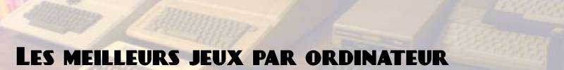

# 

Avant la dominance du standard IBM PC (duquel proviennent les PC actuels), les ordinateurs ont tous des formats propriétaires, ce qui génère un grand nombre de machines incompatibles les unes avec les autres.

**Apple II** (1977)

- Airheart
- Captain Goodnight
- Choplifter
- Flight Simulator
- Ghostbusters
- Karateka
- Maniac Mansion (+ Day of the Tentacle)
- Might and Magic (1, 2)
- Moon Patrol
- Prince of Persia
- Sid Meier's Pirates!
- Skyfox
- Space Quest (1, 2)
- Swashbuckler
- The Bard's Tales (1, 2, 3)
- The Goonies
- Ultima (1 à 5)
- Wizardry (1 à 5)

**IBM PC/MS-DOS** (1981-1997)

- Civilization (1, 2)
- Command & Conquer (+ Red Alert)
- Descent
- Doom (1, 2)
- Dune 2
- Eye of the Beholder
- Flight Simulator (1 à 5)
- Heroes of Might & Magic (1, 2)
- Point & clicks Lucas Arts (Maniac Mansion, Monkey Island, Indiana Jones, Sam & Max, Full Throttle...)
- Point & clicks Sierra (King's Quest, Space Quest, Leisure Suit Larry, Police Quest)
- Quake
- Sim City (1, 2000)
- The Elders Scrolls 2 Daggerfall
- Transport Tycoon
- Ultima (6 + Underworld 1 & 2)
- Warcraft (1, 2)
- Wing Commander (1 à 4, Privateer)
- Wolfenstein 3D
- X-Wing (+ TIE Fighter)
- XCOM Enemy Unknown/UFO Defense

**Atari 5200/400/800/XL/XE/XEGS** (1982)

- Boulder Dash
- Bounty Bob Strikes Back
- Bruce Lee
- Dropzone
- Encounter
- Fort Apocalypse
- Lode Runner
- Pitfall 2
- Rescue on Fractalus
- The Great American Cross Country Road Race

**Commodore 64** (1982)

- Airborne Ranger
- Bruce Lee
- Bubble Bobble
- Defender of The Crown
- International Karate +
- Io
- Last Ninja (1, 2)
- Maniac Mansion
- Microprose Soccer
- Pirates !
- Project Firestart
- Revs
- The Great Giana Sisters
- The Way of the Exploding Fist
- Uridium

**ZX Spectrum** (1982)

- Alien 8
- Atic Atac
- Chaos
- Chuckie Egg
- Elite
- Fantasy World Dizzy
- Head Over Heels
- Jet Set Willy
- Knight Lore
- Manic Miner
- MYTH: History in the Making
- Laser Squad
- Lords of Midnight
- Lunar Jetman
- Rex
- Skool Daze
- Starquake
- The Great Escape
- The Hobbit
- Turbo Esprit

**Microsoft MSX** (1983)

- F1-Spirit
- Knightmare
- Maze of Gallious
- Nemesis (1, 2, 3)
- Parodius
- Penguin adventure
- Pippols
- Salamander

**Amstrad CPC** (1984)

- Arkanoid
- Bomb Jack
- Canadair
- Chase HQ
- Crazy Car
- Double Dragon
- Enduro Racer
- Elite
- Fruity Frank
- L'age de pierre
- La ville infernale
- Les Ripoux
- Renegade
- Robocop
- Saboteur (1, 2)
- Sapiens
- Silent Service
- Space Shuttle
- Starglider 2

**Commodore Amiga** (1985)

- Agony
- Alien Breed Special Edition 92
- Another World
- Battle Squadron
- Defender of the Crown
- Dungeon Master
- Epic
- Lemmings
- Moonstone
- No Second Prize
- Populous
- Project X
- Sensible Soccer
- Shadow of the Beast
- SpeedBall II
- The Chaos Engine
- Turrican (1, 2, 3)
- Unreal
- Xenon 2
- Zool

**Atari ST** (1985)

- Cannon Fodder
- Carrier command
- Falcon
- Hard drivin
- Interphase
- L'Arche du Capitaine Blood
- Le Manoir de Mortevielle
- Midwinter
- Powerdrome
- Sapiens
- Starglider 2
- Stunt Car Racer
- Vroom

**Microsoft MSX2** (1985)

- Aleste (1, 2)
- Dragon slayer (série)
- Metal Gear (1, 2)
- Snatcher
- Space Manbow
- Treasure of Usas
- Vampire killer
- Xak (série + Fray)
- Ys (série)
- Zanac ex

**Sharp X68000** (1987)

- Akumajou Dracula
- Aquales
- Downtown Nekketsu Story
- Final Fight
- Ghouls 'n Ghosts
- Gradius 2
- Parodius Da!
- R-Type
- Strider
- Super Street Fighter II

**Windows 95/98** (1995-2001)

- Age of Empires 1, 2
- Donjons & Dragons Bioware/Black Isle (Baldur's Gate 1, 2, Planescape Torment, Icewind Dale 1, 2, Neverwinter Nights)
- Civilization 2, Alpha Centauri
- Deus Ex
- Diablo 1, 2
- Fallout 1, 2
- Flight Simulator 2000
- Freespace 2
- Grand Prix Legends
- Half-Life, Counter Strike
- Interstate 76
- Jedi Knight 1, 2
- Little Big Adventure 1, 2
- Myst, Riven
- Operation Flashpoint
- Quake 2, 3
- Starcraft
- Thief 1, 2
- Total Annihilation
- Unreal, Unreal Tournament
