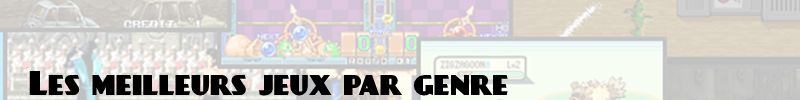

# 

Les meilleurs jeux par genre, indépendamment de la plateforme.

J'essaye de couvrir un peu toutes les générations pour chaque genre.

Les numéros des séries ne sont pas notés (il y a une liste "meilleurs épisodes des séries" juste au-dessus), et toutes les plateformes ne sont pas toujours notées non plus.

## Plateforme

- Banjo Kazooie/Tooie (Nintendo 64)
- Castle of Illusion (Master System, Megadrive)
- Crash Bandicoot (Playstation)
- Donkey Kong (Arcade, NES)
- Donkey Kong Country (SNES, Game Boy Advance)
- Duck Tales (NES, Game Boy)
- Kirby (NES, SNES, Game Boy Advance)
- Oddworld : Abe's Odyssey (Playstation)
- Prince of Persia (MS DOS, NES, SNES, Megadrive)
- Rayman (Playstation, Windows)
- Sonic (Master System, Megadrive, Mega CD, Game Boy Advance)
- Sonic Adventure (Dreamcast)
- Super Mario (NES, SNES, Nintendo 64, Game Boy, Game Boy Advance, Gamecube, Nintendo DS)
- Wario Land (Game Boy, Game Boy Color, Game Boy Advance)
- World of Illusion (Megadrive)

## Plateforme/action, run & gun

- Aladdin (Megadrive, SNES)
- Astro Boy Omega Factor (Game Boy Advance)
- Castlevania (NES, SNES, Megadrive, PC Engine)
- Conker's Bad Fur Day (Nintendo 64)
- Contra (NES, SNES, Megadrive)
- Earthworm Jim (Megadrive, SNES)
- Flashback (Megadrive, SNES, Amiga)
- Gunstar Heroes (Megadrive, Game Boy Advance)
- Jazz Jackrabbit (MS DOS)
- Mega Man (NES, SNES), Mega Man X (SNES, Playstation), Mega Man Zero (Game Boy Advance), Mega Man ZX (Nintendo DS)
- Metal Slug (NeoGeo)
- Ninja Gaiden (NES, Master System)
- Rocket Knight (Megadrive)
- Shinobi (Arcade, Master System, Megadrive)
- Strider (Megadrive)

## Metroid-like, metroidvania & assimilés

- Alien Infestation (Nintendo DS)
- Castlevania (Playstation, Game Boy Advance, Nintendo DS)
- Metroid (NES, SNES, Game Boy Advance)
- Metroid Prime (Gamecube)
- Wonder Boy Dragon's Trap (Master System), Monster World (Megadrive)

## Aventure/action

- Alone in the Dark (MS DOS, 3DO)
- Beyond Good & Evil (Gamecube)
- Beyond Oasis/La Légende de Thor (Megadrive)
- Ico (Playstation 2)
- Legacy of Kain: Soul Reaver (Playstation)
- Little Big Adventure (MS DOS)
- Shadow of the Colossus (Playstation 2)
- Shenmue (Dreamcast)
- The Nomad Soul (Dreamcast)
- Zelda (NES, SNES, Game Boy Color, Nintendo 64, Gamecube, Nintendo DS)

## Shooter, FPS, TPS, infiltration

- Descent (MS-DOS)
- Doom (MS DOS)
- Full Spectrum Warrior (Xbox)
- Half-Life, Counter Strike (Windows)
- Halo (Xbox)
- Hitman (Xbox)
- Jedi Knight (Windows)
- MDK (MS DOS, Windows)
- Max Payne (Xbox, Windows)
- MechAssault (Xbox)
- Metal Gear Solid (Playstation, Playstation 2, Gamecube)
- Operation Flashpoint (Windows)
- Quake (MS DOS, Windows)
- Splinter Cell (Xbox, Windows)
- System Shock (MS DOS, Windows)
- The Chronicles of Riddick (Xbox, Windows)
- Thief (Windows)
- Tomb Raider (Playstation, Playstation 2, Windows)
- Unreal, Unreal Tournament (Windows)
- Wolfenstein 3D (MS DOS)

## Survival horror

- Alone in the Dark (MS DOS, 3DO)
- Eternal Darkness (Gamecube)
- Luigi's Mansion (Gamecube)
- Resident Evil (Playstation, Playstation 2, Dreamcast, Gamecube)
- Silent Hill (Playstation, Playstation 2)

## Baston, brawler

- Art of Fighting (NeoGeo)
- Dead or Alive (Dreamcast)
- Fatal Fury (NeoGeo)
- Garou Mark of the Wolves (NeoGeo)
- Guilty Gear (Playstation)
- King of Fighters (NeoGeo)
- Capcom Versus (Capcom vs Street Fighter, X-Men vs Street Fighter, Capcom vs Marvel...) (Playstation, Playstation 2, Dreamcast)
- Mortal Kombat (SNES, Megadrive)
- Power Stone (Dreamcast)
- Samurai Shodown (NeoGeo)
- Smash Bros (Nintendo 64, Gamecube)
- SoulCalibur (Dreamcast)
- Street Fighter 2 (SNES, Megadrive), III (Dreamcast), Zero/Alpha (Saturn, Playstation)
- Tekken (Playstation, Playstation 2)
- Virtua Fighter 2 (Saturn)

## Beat'em up

- Battletoads (NES, SNES, Megadrive)
- Comix Zone (Megadrive)
- Double Dragon, Renegade, River City (NES, SNES, Megadrive, Game Boy Advance, Arcade)
- Final Fight (Arcade)
- God of War (Playstation 2)
- Golden Axe (Megadrive)
- Ninja Gaiden (Xbox)
- Splatterhouse (Megadrive)
- Streets of Rage (Megadrive)
- Teenage Mutant Ninja Turtles (NES, SNES, Megadrive, Arcade)

## Shoot'em up, rail shooters

- Defender (Arcade)
- DoDonPachi (Arcade)
- Fantasy Zone (Master System, Megadrive, Arcade)
- Galaga (Arcade, NES, PC Engine)
- Gradius, Parodius (NES, SNES, PC Engine)
- Ikaruga (Dreamcast)
- Last Resort (NeoGeo)
- Panzer Dragoon (Saturn)
- R-Type (PC Engine)
- Radiant Silvergun (Saturn)
- Raiden (Arcade, SNES, Megadrive, PC Engine, Playstation)
- Star Fox (SNES, Nintendo 64)
- Star Wars Rogue Squadron (Nintendo 64, Gamecube)
- Super Star Soldier (PC Engine)
- Thunder Force (Megadrive)

## RPG

- Baldur's Gate (Windows)
- Chrono Trigger (SNES)
- Deus Ex (Windows)
- Diablo (Windows)
- Dragon Quest (NES, SNES, Nintendo DS)
- Eye of the Beholder (MS DOS)
- Fable (Xbox)
- Fallout (Windows)
- Final Fantasy (NES, SNES, Playstation, Playstation 2)
- Mario RPG (SNES), Mario & Luigi (Game Boy Advance, Nintendo DS), Paper Mario (Nintendo 64)
- Might & Magic, Heroes of Might & Magic (MS DOS, Windows)
- Phantasy Star (Master System, Megadrive)
- Planescape Torment (Windows)
- Pokémon (Game Boy, Game Boy Color, Game Boy Advance, Nintendo DS)
- Secret of Mana (SNES)
- Star Wars Knights of the Old Republic (Xbox)
- The Bard's Tale (Apple II, MS DOS)
- The Elder Scrolls (Windows, Xbox)
- Ultima (Apple II, Amiga, MS DOS, Windows)
- Wizardry (Apple II, MS DOS)

## Tactique, stratégie

- Advance Wars (Game Boy Advance, Nintendo DS)
- Civilization (MS DOS, Windows)
- Command & Conquer (MS DOS, Windows)
- Dune 2 (MS DOS)
- Dungeon Keeper (MS DOS, Windows)
- Final Fantasy Tactics (Playstation, Game Boy Advance, Nintendo DS)
- Fire Emblem (Game Boy Advance, Nintendo DS)
- Front Mission 3 (Playstation)
- Populous (Amiga, SNES, MS DOS)
- Shining Force (Megadrive, Mega CD, Saturn, Game Boy Advance)
- Sim City (MS DOS, Windows)
- Starcraft (Windows)
- Transport Tycoon (MS DOS)
- Warcraft (MS DOS, Windows)
- XCOM (MS DOS, Windows)

## Point & click

- Beneath a Steel Sky (Amiga, MS DOS)
- Day of the Tentacle, Maniac Mansion (MS DOS)
- Discworld 2 (MS DOS)
- Dune (Mega CD)
- Gabriel Knight (MS DOS)
- Ghost Trick (Nintendo DS)
- Indiana Jones (Amiga, MS DOS)
- King's Quest (Apple II, MS DOS)
- Kyrandia 2 - The Hand of Fate (Amiga)
- Monkey Island (Apple II, Amiga, MS DOS, Windows)
- Myst, Riven (Windows)
- Phoenix Wright (Nintendo DS)
- Sam & Max (MS DOS)
- Snatcher (Mega CD)
- Space Quest (Apple II, MS DOS)

## Puzzle/action

- Chu Chu Rocket (Dreamcast)
- Dr Mario (NES)
- Lemmings (Amiga, MS DOS)
- Lumines (PSP)
- Magical Drop (NeoGeo)
- Puyo Puyo (Megadrive, Arcade)
- Puzzle Bobble (SNES, Playstation, Arcade)
- Super Picross (SNES)
- Super Puzzle Fighter 2 Turbo (Saturn, Playstation)
- Tetris (Game Boy, Game Boy Color, Nintendo DS)

## Sport

- 1080° Snowboarding (Nintendo 64)
- Final Match Tennis (PC Engine)
- ISS 64 (Nintendo 64)
- Mario Golf (Game Boy Advance)
- Mario Tennis (Game Boy Advance, Nintendo 64)
- NBA JAM (Megadrive, SNES)
- Neo Turf Master (NeoGeo)
- Pro Evolution Soccer 6 FE (Gamecube)
- Sensible Soccer (Amiga)
- SSX Tricky (Playstation 2)
- Speedball 2 (Megadrive)
- Tony Hawk Pro Skater (Playstation, Dreamcast)
- Top Spin (Xbox)
- Virtua Tennis (Dreamcast)
- Windjammers (NeoGeo)

## Course

- Crash Team Racing (Playstation)
- F-Zero (SNES, Nintendo 64, Gamecube)
- F355 Challenge (Dreamcast)
- Forza Motorsport (Xbox)
- Gran Turismo (Playstation, Playstation 2)
- Grand Prix 2 (MS DOS)
- Grand Prix Legends (Windows)
- Lotus (Amiga)
- Mario Kart (SNES, Nintendo 64, Gamecube)
- Micro Machines (NES, SNES, Master System, Megadrive, Playstation)
- Need for Speed (3DO, Windows)
- OutRun (Master System, Megadrive, Arcade)
- Ridge Racer (Playstation, Playstation 2)
- Sega Rally (Saturn)
- Wipeout (Playstation, Playstation 2)

## Flight sim, Space sim

- Comanche (MS DOS)
- Elite, Frontier (MS DOS, Amiga)
- F-15 Strike Eagle (MS DOS)
- Falcon (MS DOS, Windows)
- Flight Simulator (MS DOS)
- Freespace (Windows)
- Independance War (Windows)
- Red Baron (MS DOS)
- Wing Commander (MS DOS, Windows)
- X (Windows)
- X-Wing, TIE Fighter (MS DOS, Windows)

## Autre

- Bomberman (NES, SNES, PC Engine)
- Pac-Man (Arcade, NES)
- Jet Set Radio (Dreamcast, Xbox)
