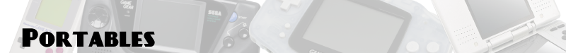

# 

**Nintendo Gameboy** (1989)

- Castlevania (II, Adventure, Legends)
- Donkey Kong Land (1, 2, 3)
- Duck Tales (1, 2)
- Final Fantasy (Adventures/Mystic Quest, Legend, Legend II, Legend III)
- Gargoyle's Quest
- Kirby (1, 2)
- Metroid II
- Motocross Maniacs
- Pokemon (Rouge, Bleu, Jaune)
- Super Mario Land (1, 2)
- Tetris
- Wario Land (1, 2)
- Zelda Link's Awakening

**Atari Lynx** (1989)

- Batman Returns
- Blue Lightning
- California Games
- Chip's Challenge
- Desert Strike
- Dracula
- Ninja Gaiden
- Rygar
- Slime World
- Super Skweek
- Toki
- Warbirds
- Zarlor's Mercenary

**Sega Game Gear** (1990)

- Aladdin
- Ax Battler - A Legend of Golden Axe
- Columns
- Deep Duck Trouble Starring Donald Duck
- Defenders of Oasis
- Ecco (The Dolphin, Tides of Time)
- GG Aleste
- Lucky Dime Caper Starring Donald Duck
- Ninja Gaiden
- Shining Force 2
- Shinobi (1, 2)
- Sonic (1, 2, Chaos)
- Sonic Drift 2
- Super Columns
- Tails Adventures

**Nintendo Gameboy Color** (1998)

- Dragon Warrior (Dragon Quest) (1, 2, 3)
- Mario Tennis
- Mario Golf
- Metal Gear Solid Ghost Babel
- Motocross Maniacs 2
- Pokemon (Argent, Or, Cristal)
- Shantae
- Survival Kids
- Super Mario Bros Deluxe
- Wario Land (2, 3)
- Zelda (Oracle of Age, Oracle of Seasons)

**SNK NeoGeo Pocket/Color** (1998)

- Biomotor Unitron
- Faselei
- King of Fighters R2
- Metal Slug (1, 2)
- Neo Turf Masters
- Puyo Pop
- Puzzle Bobble Mini
- SNK Gals Fighters
- SNK vs Capcom Card Fighters (1, 2)
- SNK vs Capcom Match of the Millenium
- Sonic The Hedgehog Pocket Adventure
- The Last Blade

**Bandai WonderSwan** (1999)

- Beatmania
- Blue Wing Blitz
- Dicing Knight Period
- Final Fantasy (1, 4)
- Final Lap 2000
- Golden Axe
- Gunpey
- Klonoa of the Wind
- Makaimura (Ghosts n Goblins)
- Mr. Driller
- One Piece: Grand Battle Swan Colosseum
- Pocket Fighter
- Puzzle Bobble
- Rainbow Islands
- Rockman & Forte
- Tane Wo Maku Tori
- Tetris

**Nintendo Gameboy Advance** (2001)

- Advance Wars (1, 2)
- Boktai (1, 2)
- Castlevania (Circle of the Moon, Harmony of Dissonance, Aria of Sorrow)
- Final Fantasy (I&II, IV, V, VI)
- Final Fantasy Tactics Advance
- Fire Emblem (tout court, Sacred Stones)
- Golden Sun (1, 2)
- Kirby (Nightmare in Dreamland, Amazing Mirror)
- Mario & Luigi Superstar Saga
- Megaman Zero (1 à 4)
- Metroid (Zero Mission, Fusion)
- Mother 3
- Pokemon (Rouge Feu, Vert Feuille, Rubis, Saphir, Emeraude)
- Rhythm Tengoku
- Sonic Advance (1, 2, 3)
- Super Mario Advance (1 à 4)
- Sword of Mana
- Wario Land 4
- Wario Ware Inc
- Zelda (Link to the Past, Minish Cap)

**Nintendo DS** (2004)

- Advance Wars (Dual Strike, Dark Conflict)
- Castlevania (Dawn of Sorrow, Portrait of Ruin, Order of Ecclesia)
- Dragon Quest (4 à 9)
- Elite Beat Agents (et Osu! Tatakae! Oendan! 1 & 2)
- Final Fantasy Tactics A2
- Final Fantasy (3, 4)
- Fire Emblem Shadow Dragon
- Ghost Trick
- Grand Theft Auto Chinatown Wars
- Kirby Canvas Curse
- Mario Kart DS
- Megaman ZX & ZX Advent
- New Super Mario Bros
- Picross 3D
- Phoenix Wright (Ace Attorney, Trials and Tribulations, Justice for All, Apollo Justice)
- Pokemon (Pearl, Diamond, Platinum, Black, White, Black 2, White 2, HeartGold, SoulSilver)
- Professeur Layton
- Zelda (Spirit Tracks, Phantom Hourglass)

**Sony PSP** (2004)

- Crush
- DBZ Shin Budokai
- Ecochrome
- Everybody's Tennis
- God of War (1, 2)
- GTA Chinatown Wars
- Mega Man Powered Up
- Patapon
- Silent Hill Shattered Memories
