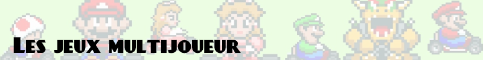

# 

Le but est de proposer une liste de jeux rétro, soit à sortir en soirée ou en LAN rétro, soit à faire en duo avec conjoint(e) et/ou enfant, donc :

- le jeu doit être fun, évidemment
- le jeu doit être multijoueur local, split screen ou LAN : pas de multijoueur en ligne uniquement (les serveurs seront probablement hors-ligne depuis...)
- pas de jeu solo "hotseat" où on joue chacun son tour (ça marche avec tous les jeux solo), uniquement du versus et du coop ; les multi hotseat versus prévus pour sont acceptés, comme Heroes of M&M, Advance Wars, etc.

Je mets en vrac les séries, faites un croisement avec les meilleurs épisodes des séries et les meilleures portages des jeux.

## Coop

### Shmups

- 1943 Kai (PC Engine, arcade)
- 1944 The Loop Master (arcade)
- Batsugun (arcade)
- Detana!! Twin Bee (PC Engine)
- DoDonPachi (arcade)
- Dogyuun (arcade)
- Ikaruga (Dreamcast)
- Life Force (NES, arcade)
- Pulstar (arcade)
- Raiden (arcade)
- Strikers 1945 (arcade)
- Twinbee (NES, SNES, PC Engine, arcade)
- Twinkle Star Sprites (arcade)
- Wild Guns (SNES)

### Twin stick shooters

- Alien Breed (DOS, Amiga)
- Dungeon Explorer (PC Engine, Mega CD)
- Gauntlet (arcade)
- Legend of the Mystical Ninja (SNES)
- Shock Troopers (arcade)
- Smash TV (Megadrive, SNES, arcade)
- The Chaos Engine (Amiga, Megadrive)

### Run & gun

- Alien Storm (Megadrive, arcade)
- Contra / Probotector (NES, SNES, Megadrive, arcade)
- Gunstar Heroes (Megadrive)
- Metal Slug (arcade)
- Rolling Thunder (Megadrive, arcade)
- Sunset Riders (SNES, Megadrive, arcade)
- Top Hunter (arcade)

### Autres shooters : FPS, TPS, light gun...

- Double Hawk (Master System)
- Global Defence Force (PS2)
- Halo (Xbox)
- House of the Dead (Saturn, Dreamcast, arcade)
- Virtua Cop (Saturn, arcade)

### Beat'em up

- Alien vs. Predator (arcade)
- Altered Beast (Megadrive, arcade)
- Arabian Fight (arcade)
- Arabian Magic (arcade)
- Armored Warriors (arcade)
- Battle Circuit (arcade)
- Battletoads (NES, Megadrive, arcade)
- Cadillacs and Dinosaurs (arcade)
- Captain America and The Avengers (arcade)
- Captain Commando (arcade)
- Double Dragon (NES, SNES, Master System, Megadrive, arcade)
- Dungeons & Dragons (Shadow over Mystara, Tower of Doom) (arcade)
- Final Fight (SNES, arcade)
- General Chaos (Megadrive)
- Golden Axe (Megadrive, arcade)
- Guardian Heroes (Saturn)
- Knights of the Round (arcade)
- Mighty Morphin Power Rangers (SNES)
- Mystic Warriors (arcade)
- River City Ransom (NES)
- Streets of Rage (Megadrive)
- TMNT / Teenage Mutant Ninja Turtles (NES, SNES, Megadrive, arcade)
- The Combatribes (SNES, arcade)
- Warriors of Fate (arcade)
- X-Men (arcade)

### Plateforme

- Bubble Bobble (NES, Master System, arcade)
- Chip'n Dale Rescue Rangers / Tic & Tac Rangers du Risque (NES)
- Donkey Kong Country (SNES)
- Ice Climber (NES)
- Jazz Jackrabbit (Windows)
- Parasol Stars (PC Engine, arcade)
- Snow Brothers (Megadrive, arcade)
- Sonic 2, 3 (Megadrive)
- World of Illusion (Megadrive)

### RPG, aventure

- Diablo (Windows)
- Final Fantasy Crystal Chronicles (Gamecube)
- Goof Troop (SNES)
- Legend of Foresia (PS1)
- Secret of Mana (SNES)
- Zelda Four Swords Adventure (GBA + Gamecube)
- Zombies Ate My Neighbours (SNES, Megadrive)

### Sport

- FIFA (SNES, Megadrive, PS1, PS2, N64, Gamecube, Xbox)
- ISS/PES (SNES, N64, PS1, PS2)
- Mario Football (Gamecube)
- Mario Tennis (GBC, N64, Gamecube)
- Sensible Soccer (Amiga, SNES, Megadrive)
- Smash Tennis (SNES)
- Top Spin (PS2, Xbox)
- Virtua Tennis (Dreamcast)

### Autre

- Commandos 2 (Windows)
- Pac-Man Vs (Gamecube)
- Pikmin 2 (Gamecube)
- The Lost Vikings (SNES, Megadrive)
- ToeJam and Earl (Megadrive)
- We Love Katamari (PS2)

## Versus

### Course

- 1080° Snowboarding (N64)
- Burnout (PS2, Gamecube, Xbox)
- Carmageddon (DOS, Windows)
- Destruction Derby (PS1)
- Diddy Kong Racing (N64)
- F-Zero (SNES, N64, Gamecube)
- F355 Challenge (Dreamcast)
- Forza Motorsport (Xbox)
- Gran Turismo (PS1, PS2)
- Grand Prix Legends (Windows)
- Hydro Thunder (Dreamcast)
- Mario Kart (SNES, N64, Gamecube, GBA, DS)
- Metropolis Street Racer (Dreamcast)
- Micro Machines (NES, Master System, Megadrive)
- Moto Racer (PS1, Windows)
- Motocross Maniacs (GB)
- Neo Drift Out (arcade)
- Project Gotham Racing (Xbox)
- Ridge Racer (PS1, PS2)
- Road Rash (Megadrive)
- SEGA Rally Championship (Saturn)
- Star Wars Episode I - Racer (N64)
- Super Monaco GP (Megadrive)
- Super Off Road (NES)
- Super Skidmarks (Megadrive)
- Trash Rally (arcade)
- Virtua Racing Deluxe (32X)
- Wave Race (N64)
- Wipeout (PS1, PS2, N64)

### Combat, baston, fighting, versus, brawlers

- 3 Count Bout (arcade)
- Art of Fighting (arcade)
- Bushido Blade (PS1)
- Capcom Versus (Marvel vs Street Fighter, X-Men vs Street Fighter, Marvel vs Capcom, SNK vs Capcom) (PS1, Saturn, Dreamcast, arcade)
- Darkstalkers (+ Vampire Savior, Vampire Hunter) (arcade)
- Dead or Alive (Dreamcast, PS2, Xbox)
- Dragon Ball Z (SNES, Megadrive, PS2)
- Dragon Ball Z Budokai (PS2)
- Eternal Champions (Megadrive)
- Fatal Fury, Real Bout Fatal Fury (arcade)
- Garou Mark of the Wolves (arcade)
- Killer Instinct (SNES, N64)
- King of Fighter (arcade)
- King of the Monsters (SNES, NeoGeo, arcade)
- Micro Mages (NES)
- Mortal Kombat (SNES, Megadrive, arcade)
- Pocket Fighter (Saturn)
- Power Stone (Dreamcast)
- Samurai Shodown (arcade)
- SoulCalibur, Soul Edge (Dreamcast, PS1, PS2, Gamecube, Xbox, arcade)
- Street Fighter II (SNES, Megadrive, arcade)
- Street Fighter III (Dreamcast, PS2, Xbox, arcade)
- Street Fighter Alpha/Zero (PS1, Saturn, arcade)
- Super Smash Bros (N64, Gamecube)
- Tekken (PS1, PS2)
- The Last Blade (arcade)
- Tobal n°2 (PS1)
- Virtua Fighter (32X, Saturn, PS2, Xbox, arcade)

### Stratégie, tactique

- Advance Wars / Nintendo Wars (GBA, DS, Gamecube)
- Age of Empires (Windows)
- Civilization (DOS, Windows)
- Command & Conquer (DOS, Windows)
- Dune 2 (DOS, Amiga)
- Final Fantasy Tactics Advance (GBA, DS)
- Fire Emblem (GBA, DS)
- Heroes of Might & Magic (DOS, Windows)
- Homeworld (Windows)
- Panzer General (DOS, Windows)
- Pikmin 2 (Gamecube)
- Populous (Amiga, DOS, Windows)
- Railroad Tycoon 2 (Windows)
- Rampart (SNES, arcade)
- Sim City (DOS, Windows)
- Starcraft (Windows)
- Total Annihilation (Windows)
- Transport Tycoon (DOS)
- Warcraft (DOS, Windows)
- Worms (PS1, Amiga, DOS, Windows)
- XCOM (DOS, Windows)

### FPS, TPS

- Alien vs Predator (Windows)
- Counter Strike (Windows)
- Descent (DOS, Windows)
- Doom (DOS, Windows)
- Duke Nukem 3D (DOS, Windows)
- Goldeneye 007 (N64)
- Halo (Xbox)
- Jedi Knight (Gamecube, Xbox, Windows)
- No One Lives Forever (Windows)
- Operation Flashpoint (Windows)
- Perfect Dark (N64)
- Rainbow Six (Windows)
- Quake (DOS, Windows)
- Splinter Cell Chaos Theory (Xbox, PS2, Gamecube)
- Star Fox 64 (N64)
- Timesplitters (PS2, Gamecube)
- Unreal Tournament (Windows)

### Autres shooters

- Combat (Atari 2600)
- Interstate 76 (Windows)
- Twisted Metal (PS1)
- X-Wing vs TIE Fighter (Windows)

### Sport

- Athlete Kings (Saturn)
- Basketball Nightmare (Master System)
- Baseball Stars 2 (arcade)
- Blades of Steel (NES)
- FIFA (SNES, Megadrive, PS1, PS2, N64, Gamecube, Xbox)
- ISS/PES (SNES, N64, PS1, PS2)
- Kings of the Beach (NES)
- Mario Football (Gamecube)
- Mario Tennis (GBC, N64, Gamecube)
- NBA Hangtime, NBA Jam (SNES, Megadrive, arcade)
- NHL 94 (SNES, Megadrive)
- NHL Open Ice (PS1)
- Nintendo World Cup (NES)
- Sensible Soccer (Amiga, SNES, Megadrive)
- Smash Tennis (SNES)
- Speedball 2 (Amiga, Megadrive)
- Super Dodgeball (PC Engine, arcade)
- Tecmo Bowl (NES, arcade)
- The Main Event (arcade)
- Tiny Toon Adventures: ACME All-Stars (Megadrive)
- Top Spin (PS2, Xbox)
- Track & Field / Hyper Sports (NES, PS1, arcade)
- Virtua Tennis (Dreamcast)
- Windjammer (arcade)

### Puzzle

- Chu Chu Rocket (Dreamcast)
- Columns (Game Gear, Master System, Megadrive, arcade)
- Dr Mario (NES)
- Magical Drop (arcade)
- Puyo Puyo (Megadrive, arcade)
- Puzzle Bobble / Bust A Move (SNES, PS1, NeoGeo, arcade)
- Super Puzzle Fighter II Turbo (PS1, Saturn)
- Tetris (GB, SNES, arcade)

### Party game

- Fusion Frenzy (Xbox)
- Kirby Super Star (SNES)
- Mario Party (N64, Gamecube)
- Super Monkey Ball (PS2, Gamecube, Xbox)

### Autre

- Bomberman (NES, PC Engine, Neo Geo, Saturn, arcade)
- Bonanza Bros (Megadrive)
- Change Air Blade (arcade)
- Jet Set Radio Future (Xbox)
- Joust (arcade)
- Mario Bros. (NES, arcade)
- Pokemon (GB, GBC, GBA, DS, N64, Gamecube)
- Rampage (arcade, NES, Master System, N64, PS1)
- Warlords (Atari 2600, arcade)
- We Love Katamari (PS2)
