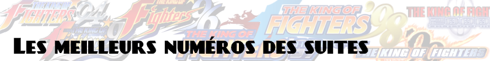

# 

Les meilleurs numéros/versions des suites comportant de multiples épisodes, mais pas forcément tous indispensables.

Le but n'est pas de donner une réponse définitive "il suffit de jouer à cet épisode", ni un classement complet, mais plutôt de pointer les meilleurs épisodes pour "entrer" dans les séries, sans forcément commencer par le premier épisode.

L'objectif est d'aider les gens qui ont entendu parler d'une série mais n'ont jamais joué à un seul épisode de s'orienter rapidement vers le meilleur épisode.

---

**Ace Combat**  
L'épisode le plus réputé est le 4e (PS2).  
Pour un plus facile à émuler, regardez le second épisode (PS1).

**After Burner**  
After Burner 2 est une "révision" du premier, sorti en arcade plus tard la même année, avec trois niveaux supplémentaires et des ajustements de gameplay.  
Les jeux sur console sont tous des portages du second épisode, sauf la version Master System.

**Aleste / Power Strike / MUSHA / Zanac / Gunhed / Blazing Lasers / Spriggan**  
C'est une nébuleuse floue de jeux à la fois très proches et très différents les uns des autres : des shmups à défilement vertical, développés par Compile, avec un système d'armes spécifique.  
Dans la série Aleste, un des épisodes les plus connus est Super Aleste/Space Megaforce (SNES).  
On peut aussi conseiller MUSHA (Megadrive) ou Robo Aleste (Mega CD).  
A noter que la série a des liens de parenté avec GunHed/Blazing Lasers (PC Engine), et donc avec Star Soldier (voir plus bas).

**Alex Kidd**  
Alex Kidd est une série créée pour essayer de "contrer" Mario, mais qui est partie dans tous les sens dès le début.  
Miracle World (MS) est l'épisode le plus connu et le plus souvent recommandé, mais a très, très mal vieilli.  
Shinobi World (MS) est le second épisode le plus recommandé.  
Les autres épisodes fluctuent entre le "assez mauvais" et le "atroce".

**Art of Fighting**  
C'est le troisième épisode (arcade) qui est le plus réputé niveau gameplay.

**Asterix**  
Astérix (MS) et la Mission Secrète (MS) sont très sympathiques, bien qu'un peu basiques.  
Le jeu d'arcade (1992) est un très bon beat'em up.  
Evitez les épisodes sur Nintendo, développés par Infogrammes, réputé pour la mauvaise qualité de ses jeux.

**Atelier**  
La série de "JRPG de crafting" Atelier est relativement récente (PS1), mais longue et prolifique : épisodes principaux, portages, remakes, versions deluxe, et spin-off, il y a de quoi se perdre, et beaucoup n'ont jamais été traduits. A noter qu'ils forment généralement des séries entre 2 et 4 épisodes.  
Dans les épisodes "vraiment rétro" (PS1/PS2), Mana Khemia est la série la plus recommandée, suivie de Iris.  
Pour les épisodes plus récents, un [guide pour bien démarrer dans la série](https://barrelwisdom.com/info/atelier-series-guide/) existe.

**Batman**  
Il y a eu de très, très nombreux jeux, totalement différents les uns des autres, par des développeurs souvent différents, de qualité allant de "très mauvais" à "très bon".  
Les épisodes les plus notables sont : Batman (NES, 1989), Batman (Megadrive, 1990), Batman Return of the Joker (NES, 1991), Batman Returns (SNES, 1992), The Adventures of Batman & Robin (SNES, 1994).

**Battletoads**  
Le premier épisode (NES, Megadrive) est le plus connu, mais c'est un jeu qui a beaucoup de problèmes d'équilibrage ; préférez la version Megadrive.
Le jeu d'arcade (1994) est aussi très réputé.

**Bomberman / Dyna Blaster / Atomic Punk**  
Les versions les plus recommandées sont Bomberman 94 (PC Engine), et Saturn Bomberman (Saturn), jouable jusqu'à 10. Les épisodes SNES sont également bons.  
Bomberman 64 (N64) et sa "suite" Bomberman Generation (GC) sont réputés pour leurs modes solo complets.

**Bubble Bobble / Parasol Stars**  
Bubble Bobble (arcade, NES, MS) est l'original et la référence, mais ensuite ça part un peu dans tous les sens.  
Parasol Stars (NES, PC Engine) est la meilleure suite, mais Rainbow Islands (arcade, NES, PC Engine) est aussi très bon.

**Burnout**  
L'épisode le plus populaire est Takedown (PS2, Xbox), suivi par Revenge (PS2, Xbox).

**Capcom versus**  
La plupart des jeux de la série "versus" de Capcom sont très bons, et vous pouvez très bien en choisir un juste basé sur son roster.  
Les plus réputés sont Capcom vs SNK 2 (arcade, DC, PS2, Xbox, GC) et Marvel vs Capcom 2 (arcade, DC, PS2, Xbox).

**Castlevania**  
Castlevania est une série qui a des jeux de 3 styles : plateforme/action linéaire, metroidvania, et action 3D.  
En plateforme/action, privilégiez l'épisode 4 (SNES), mais jetez aussi un oeil aux épisodes 1, 3 (NES), et Rondo of Blood (PC Engine CD, ou dans Dracula X Chronicles sur PSP).  
En metroidvania, les références sont Symphony of the Night (PS1), Aria of Sorrow (GBA) et Dawn of Sorrow (DS).  
En action 3D, il n'y a pas grand-chose de vraiment bon, honnêtement.

**Columns**  
Le premier épisode sur Game Gear est le plus connu, étant le jeu vendu en bundle avec la console (comme Tetris GB).  
Cependant, c'est le troisième épisode (arcade, Megadrive) qui est le plus complet, avec un mode histoire, des "combats" comme dans Puyo Puyo, des items, etc.

**Contra / Probotector**  
L'épisode le plus connu est le premier sur NES, même s'il en existe également une version arcade.  
Contra 3 (SNES) est probablement le meilleur de la série "classique", mais aussi un des plus durs.  
Hard Corps (Megadrive) est également très bon, même si assez différent.  
Contra 4 (DS) est également assez réputé.  
En revanche, évitez les épisodes 3D, généralement assez mauvais.

**Crash Bandicoot**  
C'est l'épisode Warped (PS1) qui est le plus conseillé.  
A noter Crash Team Racing (PS1), un bon Mario Kart-like.

**Dead or Alive**  
Dead Or Alive 2 Ultimate (Xbox) est le plus complet, et le troisième épisode (Xbox) le plus accessible.  
Le second épisode "tout court" (PS2, DC) sera plus facile à émuler.

**Desert Strike / Jungle Strike / Urban Strike**  
Jungle Strike (Megadrive, SNES) est le plus complet et équilibré.  
Le reste de la série est bon.

**Donald**  
Quackshot (Megadrive) est excellent et très connu.  
Maui Mallard in Cold Shadow (SNES, Megadrive) est aussi très bon, mais beaucoup moins connu.

**Donkey Kong**  
Le premier Donkey Kong (arcade) est une référence légendaire de la plate-forme arcade. Le second épisode, Donkey Kong Jr (arcade) est aussi sympathique, dans un genre assez différent.  
L'épisode Game Boy est  en fait un jeu de plateforme/puzzle, initiateur de la série Mario vs Donkey Kong.  
Dans la série Country (SNES), c'est le second épisode qui est le plus réputé, le premier ayant moins bien vieilli, et le troisième étant assez différent.  
On pourra noter aussi DK Jungle Climber (DS) et King of Swing (GBA), tous deux très proches (Jungle Climber est meilleur mais la GBA est plus facile à émuler) et originaux.

**Doom**  
Les avis divergent pour savoir si le meilleur "vieil" épisode est le premier ou le second épisode. Dans les deux cas, vous ne devriez pas être déçu, sur PC bien sûr.  
Doom 3 (PC, Xbox) est très différent, avec une approche un peu plus "horreur/suspense".

**Double Dragon**  
Les épisodes les plus populaires sont le 2 (arcade, NES) et Super (SNES), ainsi que Advance (GBA).  
Le premier épisode est le plus connu notamment à cause de sa célèbre version NES, mais ce n'est pas le meilleur.  
Si la série vous intéresse, jetez aussi un oeil à Battletoads & Double Dragon (NES, SNES, Megadrive).

**Dragon Ball / Dragon Ball Z**  
Il y a environ 5 milliard de jeux DBZ, difficile d'en conseiller juste un ou deux.  
En jeu de combat, Super Butoden 2/La Légende Sayen (SNES), Hyper Dimension (SNES), Budokai 3 Collector Edition (PS2) et Supersonic Warriors (GBA) seront les plus recommandés.  
En jeu d'aventure/RPG, regardez donc Advance Adventure (GBA) et Attack of the Saiyans (DS).

**Dragon Quest / Dragon Warrior**  
Les jeux ne sont pas situés dans le même univers, sauf certains qui forment des trilogies : 1-3 et 4-6. En-dehors de ceux-là, vous pouvez les faire dans n'importe quel ordre.  
Les épisodes les plus recommandés pour découvrir la série sont les 8 (PS2, 3DS, mobile), 5 (SNES, PS2, DS, mobile) et 4 (NES, PS1, DS, mobile).  
[Un guide bien pratique pour avoir un aperçu de la série](https://imgur.com/a/cuBFqFB).  
A noter aussi les spin-off DQ Monsters, qui sont des Pokémon-like.

**Dragon Slayer / Xanadu / Faxanadu / Sorcerian / The Legend of Heroes / Lord Monarch**  
Comme vous pouvez le constater, la "méga série" Dragon Slayer est composée de nombreux épisodes, sous-séries, et spin-off. C'est aussi une série qui aime changer de style au gré des épisodes (RPG temps réel ou au tour par tour, plateforme, aventure, stratégie...), il est donc très difficile de s'y retrouver.  
La bonne nouvelle, c'est qu'à part la sous-série Trails, la plupart ne forment pas une continuité, vous pouvez donc les faire dans l'ordre que vous voulez.  
Si vous souhaitez réellement découvrir le premier épisode et Xanadu, qui ont extrêmement mal vieilli, jouez aux versions Saturn dans la compilation Falcom Classics.  
Faxanadu est le seul épisode de la sous-série Xanadu a avoir été localisé, sur NES, et c'est un des jeux qui a le mieux vieilli.  
Sorcerian est complexe mais intéressant, avec une version DOS très fidèle à l'original, et c'est la seule localisée. Les versions Mega CD et PC Engine CD très bonnes mais en Japonais.  
Lord Monarch est un STR à tester avec le freeware Lord Monarch Online sur Windows, la seule version localisée officiellement.  
Legend of Heroes est partie de Dragon Slayer pour former progressivement sa propre sous-série, Trails. Le premier, Dragon Slayer The Legend of Heroes, est le seul "vieil" épisode à avoir été localisé (sur TurboGrafx-CD) mais n'a rien de spécial. La duologie Trails in the Sky a été localisée sur PSP, et les jeux sont bons. La série est très bien reçue depuis Trails of Cold Steel.

**Ecco**  
Le premier épisode (Megadrive, Mega CD) est le plus connu, mais il est aussi débilement difficile (la version Mega CD ajoute des checkpoints).  
Le second épisode (Megadrive mais surtout Mega CD) est meilleur en tous points.  
A noter Ecco Jr (Megadrive), un épisode simplifié, qui reprend juste le gameplay du début du premier jeu, considéré comme trop facile mais relaxant.

**F-Zero**  
La série a deux styles de jeux : certains sont en "Mode 7", en fausse 3D comme sur SNES ; et d'autres sont en vraie 3D. Les feelings de chacun sont très différents.  
En "Mode 7", le plus connu et le plus populaire est l'original sur SNES, mais les épisodes GBA sont aussi bons.  
En 3D, l'épisode X (N64) est excellent, mais l'épisode GX (GC) est aussi très bon.

**Fantasy Zone**  
Fantasy Zone 2 (Master System) est le plus populaire, mais le premier (arcade, Master System) et le Super (Megadrive) sont aussi très bons.

**Fatal Fury / Garou / Real Bout**  
Garou Mark of the Wolves (arcade, NeoGeo) est, de loin, le meilleur épisode le plus populaire de la série, mais c'est un spin-off.  
Dans la série principale, Real Bout Fatal Fury 2 (arcade, NeoGeo) est le plus réputé.  
Les trois premiers épisodes "normaux" (pas Real Bout) sont ceux qui ont le moins bien vieilli.

**Final Fantasy (série principale)**  
Sauf exception (X/X-2) les épisodes n'ont rien à voir les uns avec les autres. Inutile de vouloir faire les premiers pour comprendre les suivants.  
Les épisodes "mythiques" sont le 6 (SNES) et le 7 (PS1).  
Globalement : les 1-3 (NES) ont mal vieilli, les 4-9 (SNES et PS1) sont très bons, et les épisodes PS2 sont source de division (ça ne s'arrange pas par la suite).

**Final Fantasy (spin-offs)**  
La série Tactics est excellente, particulièrement le Advance (GBA) mais avec un ton plus enfantin que le premier Tactics (PS1, PSP).  
On peut noter aussi Crystal Chronicles (GC), un épisode orienté multijoueur.

**Final Fight**  
Le premier épisode (version arcade) est la référence.  
Les épisodes 2 et 3 (SNES) sont corrects mais avec chacun leurs défauts.  
A noter Mighty Final Fight sur NES qui a un look "chibi" et des éléments RPG.

**Fire Emblem**  
La série a commencé à être traduite sur GBA ; la plupart des épisodes NES et SNES n'ont pas été traduits (ou avec des fantrads).  
Les épisodes Path of Radiance (Gamecube), Fire Emblem tout court (GBA) et Sacred Stones (GBA) sont les plus recommandés.

**Front Mission**  
Dans les "vieux" épisodes, c'est le 3e (PS1) qui est le plus réputé.  
Un peu plus récent, le 5e (PS2) est aussi très recommandé.

**Galaxian / Galaga**  
Avec son système à un seul tir à la fois, Galaxian (arcade) a vraiment trop vieilli pour être conseillé.  
Galaga (arcade, NES) est correct, mais c'est Galaga 88/90 (arcade, PC Engine) qui est le meilleur épisode.

**Gobliiins**  
Le premier épisode (Amiga, DOS) est celui qui sera le plus recommandé.

**Golden Axe**  
L'épisode le plus plébiscité est Revenge of Death Adder (arcade).  
Le premier épisode (arcade, Megadrive) est le plus connu de la série, mais il a moins bien vieilli.

**Gradius / Nemesis / Salamander / Life Force / Parodius**  
Le premier épisode, et notamment sa version NES, est le plus connu, mais c'est la version PC Engine qui est la meilleure, et même supérieure à l'arcade sur certains points.  
Les épisodes Gaiden (PS1) et 5 (PS2) sont les plus recommandés par les fans de la série.  
Le numéro 3 (arcade) est considéré comme le plus difficile, et le Galaxies/Advance (GBA) le plus facile.  
En spin-off, jetez un oeil à Parodius Da! (arcade, PC Engine, SNES), qui est basé sur le même concept mais en "mignon".

**Gran Turismo**  
Globalement c'est une série "itérative" qui s'améliore avec le temps.  
Privilégiez donc l'épisode le plus récent qui vous est accessible, même si les deux premiers (sur PS1) ont conservé un certain charme.

**Grand Theft Auto / GTA**  
Dans les épisodes 2D, c'est GTA2 (PC, PS1) qui est le plus réputé.  
En 3D, privilégiez San Andreas (PS2, Xbox) ou Vice City (PS2, Xbox).

**Heroes of Might & Magic**  
C'est l'épisode 3 (Windows) qui est le plus recommandé.

**Indiana Jones**  
Fate of Atlantis (PC) est très réputé parmi les point & click Lucas Arts.  
Temple of Doom (arcade) et Greatest Adventures (SNES) sont de bons platformers.

**ISS / International Superstar Soccer / PES / Pro Evolution Soccer**  
Les épisodes les plus populaires sont ISS (SNES, 1994), ISS 64 (N64), et ISS Pro Evolution 2 (PS1).  
C'est globalement une série itérative, donc les derniers épisodes sont généralement meilleurs.

**Kick Off**  
L'épisode le plus populaire est Kick Off 2 (Amiga), ou éventuellement Super Kick Off (SNES, Megadrive) qui est plus lent.  
Evitez les suites (à partir du 3) qui n'ont plus grand-chose à voir.

**King of Fighters**  
La version 98 (arcade, NeoGeo) est largement considérée comme la meilleure de la série, notamment en version Ultimate Match/Final Edition.  
L'épisode 2002 (arcade, NeoGeo) en version Ultimate Match est aussi très réputée.  
Evitez 97, 2000 et 2001 qui sont mal équilibrés.

**King's Quest**  
L'épisode 6 (Amiga, DOS) est largement considéré comme le plus abouti, mais le numéro 3 (Amiga, DOS, Apple II) est aussi très réputé.

**Kirby**  
En "formule classique", c'est sans doute Nightmare in Dreamland (GBA) qui représente le mieux la série.  
Super Star/Super Star Ultra (SNES/DS) est une compilation de mini-jeux pas si mini que ça.  
Amazing Mirror/Labyrinthe des Mirroirs (GBA) est plus exploratoire, moins linéaire.  
Canvas Curse/Le Pinceau de Pouvoir (DS) est très original, et très bon.

**Leisure Suit Larry**  
Le 7e épisode (DOS, Windows) est largement vu comme le meilleur, suivi par les épisodes 3 (Amiga, DOS) et 6 (DOS, Windows).

**Mario / Super Mario**  
Les épisodes 2D les plus représentatifs sont Super Mario Bros 3 (NES) et Super Mario World (SNES).  
En 3D, essayez donc Super Mario 64 (N64).

**Mario Kart**  
Super Mario Kart (SNES) est très différent des autres épisodes car il a très peu d'items.  
Globalement, les épisodes suivants progressent en qualité, prenez donc l'épisode le plus récent qui vous est accessible.

**Mario Party**  
Les épisodes sont très difficiles à départager, et chacun aura ses préférences.  
Ceux qui reviennent le plus souvent sont les épisodes 2 (N64), 3 (N64) et 4 (GC).

**Mario Puzzle**  
Dr Mario (NES ou N64) est un classique du puzzle game.  
Mario's Picross/Super Picross (GB, SNES) sont de bons picross.  
Jetez aussi un oeil à Wario's Wood (NES, SNES), un puzzle game original.

**Mario RPG / Paper Mario / Mario & Luigi**  
Le grand classique qui a lancé la sous-série, c'est Super Mario RPG (SNES), toujours d'actualité.  
Paper Mario (N64) et sa suite Thousand Year Door (GC) sont également des épisodes qui reviennent le plus souvent.  
Superstar Saga (GBA) et Bowser's Inside Story (DS) sont aussi fortement conseillés.

**Mario Sports**  
En golf, Mario Golf Advance Tour (GBA) est le meilleur en solo avec son côté aventure/RPG, et Toadstool Tour (GC) le meilleur en multijoueur avec tous ses modes de jeu.  
En tennis, c'est la même histoire : Mario Tennis Power Tour (GBA) a une bonne campagne solo avec du RPG, mais Power Tennis (GC) est le plus complet en multijoueur.  
A noter aussi Mario Smash Football/Super Mario Strikers (GC), un très bon jeu de foot.

**Mega Man**  
Dans la série principale, c'est le 2nd épisode (NES) qui est le plus réputé, le 3e (NES) étant aussi très bon.  
Dans la série X, le premier épisode (SNES) est un des meilleurs, et l'épisode 4 (PS1) est le plus ambitieux.  
Dans la série Zero/ZX, c'est l'épisode 3 (DS) qui est le plus conseillé.  
En spin-off, jetez un oeil à Battle Network, notamment l'épisode 3 (GBA).

**Metal Gear / Metal Gear Solid**  
Les épisodes les plus connus de la série sont probablement le premier (PS1, GC), et le second (PS2, Xbox).  
L'épisode 3 (PS2) est bon aussi, et les épisodes Solid sur PSP sont sympathiques.  
A noter que la série avait commencé sur en 1987 sur MSX2, avec deux jeux qui posaient déjà les bases du gameplay, de l'histoire et les personnages, mais évitez les jeux NES, particulièrement l'épisode 2.

**Metal Slug**  
Les plus populaires sont les épisode 3 et X (remake du 2), tous deux sur NeoGeo.

**Metroid**  
En 2D, tous les épisodes 16 bits sont bons, mais privilégiez Super (SNES) ou Zero (GBA).  
En 3D, Prime (GC) est probablement la référence.  
Le premier (NES) et second (GB) épisodes ont pris un méchant coup de vieux.

**Mickey / Illusion**  
Les deux jeux Castle of Illusion (MS et Megadrive) sont totalement différents, mais tous deux très bons (j'ai une préférence pour la version MS).  
World of Illusion (Megadrive) est aussi très bon, et se joue en coop à deux joueurs.

**Micro Machines**  
Les meilleurs épisodes sont Turbo Tournament 96 (Megadrive) ou 64 Turbo (N64).

**Might & Magic**  
L'épisode 6 (Windows) est souvent considéré comme le meilleur de série, ainsi que le 7 (Windows).  
Les épisodes précédents sont moins accessibles, mais dans ceux-ci, l'épisode 3 (DOS, Megadrive, SNES) est le plus souvent recommandé.  
A noter que les épisodes 4 et 5 (DOS) forment une "duologie" (Le Monde de Xeen) qui permet de voyager de l'un à l'autre, mais ils ne sont pas très populaires.

**Monkey Island**  
The Curse of Monkey Island (Windows) est le plus accessible, et très bon.  
Les deux premiers épisodes (DOS) sont aussi très bons, mais un peu plus old school.

**Mortal Kombat**  
Ultimate Mortal Kombat 3 (arcade, SNES) est la version 16 bits la plus complète, mais certains lui préfèrent l'épisode 2 (arcade, SNES, Megadrive).  
Evitez les épisodes 3D des générations PS1 et PS2, oscillant entre le médiocre et le mauvais.

**Need for Speed**  
Le premier épisode (3DO, PS1, DOS) a une place spéciale dans le coeur de nombreux joueurs, mais soyons honnêtes, il a assez mal vieilli.  
C'est à partir de la génération PS2 que la série se modernise vraiment, et notamment avec Underground 2 (PS2, Xbox, GC) et Most Wanted (PS2, Xbox, GC), toujours excellents même aujourd'hui.

**NHL (16 bits)**  
NHL 94 (SNES, Megadrive, Mega CD) est souvent considéré comme un des meilleurs de cette époque, mais la version 93 (Megadrive, SNES) avait des "combats" et des blessures, retirées dans les épisodes suivants.

**Ninja Gaiden**  
Dans les anciens jeux, le premier épisode (NES) est le plus connu ; il a été refait sur SNES dans la "Trilogy".  
L'épisode Master System est aussi très sympathique, mais totalement différent.  
Après une très longue pause, la série revient sur Xbox sous forme de beat'em up, c'est notamment la version Black qui est la plus populaire.

**Nintendo Wars : Famicom Wars / Game Boy Wars / Super Famicom Wars / Advance Wars / Battalion Wars**  
La série existe depuis longtemps, mais c'est sur GBA qu'elle devient vraiment populaire : testez donc le premier Advance Wars.  
Les épisodes NES/SNES/GB ont assez mal vieilli (en plus de n'avoir pas toujours été traduit), mais tous les épisodes GBA et DS sont bons.

**Oddworld / Abe**  
Il est conseillé de commencer avec le premier épisode, Abe's Odyssey/L'Odyssée d'Abe (PS1, Windows) et de continuer sur le second, Abe's Exodus/L'Exode d'Abe (PS1, Windows).

**OutRun**  
Le grand classique est le premier (arcade), adapté sur quasiment tous les supports depuis sa sortie.  
OutRunners (arcade) est aussi conseillé, avec de bons graphismes et un mode multijoueur.  
Plus moderne, OutRun 2006 Coast 2 Coast (PS2, Xbox, PSP) est aussi très bon.  
La qualité des nombreux spin-off sur consoles oscille entre "bizarre" et "correct".

**Pac-Man**  
Le premier épisode (arcade, NES) est la référence, mais Ms Pac-Man (arcade, NES) améliore encore la formule, et beaucoup préfèrent cette version.  
Certains apprécient Pac-Mania (arcade) mais il est assez spécial.  
A noter que les épisodes récents (Pac-Man 256 et Championship Edition/DX/2, notamment) sont aussi très réputés.  
Oubliez les jeux d'aventure et de plate-forme, généralement médiocres voire mauvais. Sachez seulement que Pac-Land a été une source d'inspiration pour tous les platformers suivants : Super Mario Bros, Wonder Boy, Alex Kidd, etc.

**Panzer Dragoon**  
En rail shooter, l'épisode le plus recommandé est Orta (Xbox).  
Panzer Dragoon Saga (Saturn) est aussi très réputé, mais c'est un RPG.

**Phantasy Star**  
Les épisodes forment une continuité, mais vous ne devriez pas non plus être complètement perdu si vous commencez par la fin.  
C'est l'épisode 4 (Megadrive) qui est le plus largement recommandé pour découvrir la série.  
Le premier épisode (Master System) est aussi très bon, dans un genre un peu différent, mais a beaucoup de défauts de conception d'époque ; je conseille fortement la version Sega Ages sur Switch, excellente.  
L'épisode 3 (Megadrive) est considéré comme le moins bon de la série.

**Phoenix Wright**  
La série, qui a débuté sur GBA, a été portée sur DS, 3DS, puis maintenant toutes les consoles modernes (PS4/XOne/Switch).  
La série forme une histoire continue, il est donc conseillé de commencer par le premier.  
Si vous ne voulez en faire qu'un seul, faites le troisième (Trials & Tribulations), largement considéré comme le meilleur.  
Même si la qualité varie, et chacun aura des avis différents, aucun épisode n'est foncièrement mauvais.

**Pokémon**  
Privilégiez Argent/Or/Cristal (GBC, remake DS), Rubis/Saphir/Emeraude (GBA, remake 3DS), ou Noir/Blanc (DS).  
A noter aussi : Pokémon XD (GC), la sous-série Mystery Dungeon, et la sous-série Ranger.

**Police Quest / SWAT**  
Police Quest est une série qui a énormément évolué avec le temps. De point & click, elle s'est transformée en jeu de tactique puis en FPS.  
Les deux premiers (DOS, Amiga, Apple II) sont des classiques de jeu d'aventure, très différent des autres jeux du même genre.  
Les deux premiers Police Quest SWAT sont des jeux tactiques assez moyens.  
Les épisodes SWAT 3 et surtout le 4 (Windows) sont d'excellents FPS tactiques, encore assez uniques en leur genre aujourd'hui.

**Populous**  
Le premier Populous (DOS, Amiga, SNES) est la référence, et l'origine de tous les "God Game".  
The Beginning (Windows, PS1) est sensiblement différent mais plus moderne.

**Prince of Persia**  
Le premier épisode est une référence, en version Master System ou SNES (un peu différente).  
La trilogie Sands of Time est aussi excellente, bien que radicalement différente.

**Professeur Layton**  
Le premier épisode, Curious Village (DS) est le plus simple pour entrer dans la série.  
Il forme une trilogie avec Pandora/Diabolical Box et Lost/Unwound Future.

**Puyo Puyo**  
La plupart des épisodes n'ont pas été traduits, mais généralement, ce n'est pas très compliqué.  
Le meilleur épisode "classique" est Super Puyo Puyo Tsu (SNES), le dernier créé par Compile.  
La suite de la série, développée par Sega, est parfois assez différente ; Puyo Pop Fever (GC, DS) est un bon épisode, mais certains le trouvent insupportable.  
A noter que la série continue aujourd'hui, avec notamment Puyo Puyo Tetris et Puyo Puyo Champions qui sont tous deux très bons.

**Puzzle Bobble / Bust A Move**  
Les épisodes sont sensiblement différents en fonction de la plateforme (arcade, NeoGeo ou console).  
Le premier épisode (arcade Taito F3) est le plus "pur" et le plus simple.  
L'épisode 4 (arcade, PS1) est le plus complet.  
Certains préfèrent l'épisode 2 en version NeoGeo.

**Quake**  
La série n'a pas forcément très bien vieilli, et les épisodes sont très différents les uns des autres.  
En solo, l'épisode 2 (Windows) est probablement meilleur que le 1 (DOS).  
Le 3 (Windows) est totalement différent puisque c'est un jeu uniquement multijoueur.

**R-Type**  
C'est sans doute le premier épisode (arcade, PC Engine) qui est le meilleur de la série, avec Delta (PS1) en proche seconde position.

**Rayman**  
C'est surtout le second épisode, Great Escape (Windows, N64, PS1, DC, PS2) qui est le plus reconnu, talonné de près par le troisième, Hoodlum Havoc (Windows, PS2, Xbox, GC).  
Le premier épisode (DOS, PS1) a moins bien vieilli.

**Resident Evil**  
Resident Evil 4 (Windows, GC, PS2) est largement considéré comme le meilleur des épisodes rétro, mais c'est aussi celui qui change complètement la formule.  
Dans les "traditionnels" à écrans fixes, c'est alternativement le premier (Windows, PS1, GC) et le second (Windows, PS1, N64, DC, GC) qui sont les plus réputés.  
A noter que tous ont été remasterisés à foison sur toutes les plateformes.

**Ridge Racer**  
C'est plutôt R4 Ridge Racer Type 4 (PS1) qui est le plus recommandé, avec Rage Racer (PS1) en seconde position.

**River City / Kunio Kun / Nekketsu Koha Kunio-kun / Downtown Nekketsu**  
La série est longue, avec une tétrachiée de jeux et de variantes, de spin-off, de remakes, de versions occidentales différentes, etc.  
Il y a globalement deux grands styles de jeux : action ou sport.  
En action, le plus connu est River City Ransom/Street Gangs, notamment sa version NES, mais préférez-lui son remake GBA.  
En sport, le meilleur est Super Dodgeball, notamment sur GBA ou NeoGeo.  
Nintendo World Cup (NES) fait aussi partie de la série, étant un épisode Kunio Kun renommé pour l'occident.  
La série continue à avoir de nouveaux épisodes aujourd'hui, avec River City Girls ou River City Melee Mach, par exemple.

**Road Rash**  
Le grand classique est le premier épisode, particulièrement la version 3DO/PS1/Saturn/Windows.  
Le second épisode (Megadrive) est le plus complet, et souvent le favori chez les fans de la série.

**Samurai Shodown / Samurai Spirits**  
Comme souvent dans ce genre de série, les avis divergent énormément, et dépendent de ce que vous recherchez.  
L'épisode 2 (arcade) est de loin celui qui revient le plus souvent, avec un bon équilibrage et qui ne part pas dans tous les sens.  
A l'opposé, le 4 (arcade) est celui qui est le plus "fun".  
5 Special (arcade) est celui qui a le plus large choix de personnages tout en restant équilibré.

**Sensible Soccer**  
Le meilleur épisode, le plus abouti, est Sensible World of Soccer (Amiga) et ses mises à jour (95/96 et 96/97).

**Shin Megami Tensei / Persona / Devil Summoner / Devil Children / Devil Survivor / Last Bible**  
Encore une série complexe qui part dans tous les sens avec des jeux de plein de styles différents, des spin-off dans tous les sens, et qui n'est pas toujours localisée.  
Dans la série principale, c'est l'épisode 3, Nocturne (PS2) qui est le plus souvent recommandé.  
Dans la série Persona, préférez le 4 (PS2), en version Golden (Vita) si vous le pouvez.  
Devil Summoner Soul Hackers (Saturn, 3DS) est un dungeon crawler délicieusement désuet.  
Devil Survivor (DS, 3DS) est un TRPG avec une histoire originale et intéressante mais très "Japonais".  
Digital Devil Saga (PS2) revient aussi régulièrement dans les recommandations, mais est encore à part.

**Shining (Darkness, Force...)**  
La série a évolué avec le temps, et a adopté différents styles : dungeon crawler, tactical, RPG, action/RPG...  
Shining Force 1 (Megadrive, GBA) et 2 (Megadrive) sont de très bons tacticals, le premier étant plus facile mais moins complet que le second.  
Le troisième Shining Force (Saturn) est considéré encore meilleur, mais il est découpé en 3 jeux dont seul le premier a été traduit.  
Shining Force CD (Mega CD) est en fait une compilation des combats des deux premiers jeux en retirant l'histoire.  
Les autres jeux sont de qualité variable ; on pourra noter Shining in the Darkness (Megadrive) si vous souhaitez essayer un dungeon crawler.

**Shinobi**  
C'est l'épisode 3, Return of the Ninja Master (Megadrive) qui est de loin le plus plébiscité.  
Revenge of Shinobi (Megadrive) est aussi très réputé, mais plus lent et méthodique, comme le premier.  
Le premier épisode (arcade, Master System) est très bon mais plus vieillot ; à noter une très bonne version Sega Ages sur Switch.

**Silent Hill**  
Le meilleur épisode est le 2 (PS2, Xbox), suivi par le premier (PS1) puis le 3 (PS2).

**Sim City**  
La série s'améliore avec le temps jusqu'à l'épisode 4 (peut-être un peu trop récent pour ce topic), puis descend en flèche après.

**Sonic**  
C'est une série avec un millier d'épisodes et de spin-offs, avec des styles parfois radicalement différents, et chaque personne aura un avis différent.  
Si vous n'avez jamais joué à un seul épisode, essayez donc Sonic 3 + Knuckles (Megadrive) ; Sonic+Knuckles est une cartouche "intermédiaire" sur laquelle se branchent les autres épisodes pour rajouter des niveaux.  
Les épisodes 2 (Megadrive) et CD (Mega CD) sont aussi très réputés, dans les platformers 2D, et tous les trois se disputent souvent la première place dans les classements.  
Le premier épisode (Megadrive) a un peu moins bien vieilli, avec un level design très lent à partir du second niveau, qui ne colle pas du tout avec le reste de la série.  
En platformer 3D, essayez donc Adventures 2 (Dreamcast).  
Le reste de la série a des hauts et des (très) bas.

**Space Quest**  
Les avis divergent radicalement selon les personnes, chaque jeu ayant des qualités et des défauts.  
Les épisodes 4, 5 et 6 (DOS, Windows) reviennent le plus souvent, le 6 étant probablement le plus moderne et accessible.  
Dans l'ensemble les jeux sont difficiles et tordus, et il est souvent possible de se retrouver bloqué sans possibilité d'avancer.

**Splatterhouse**  
Les trois épisodes sont appréciés différemment, mais il faut savoir qu'ils ont assez mal vieilli, et sont lents et basiques. Reste leurs ambiances inimitables.  
Le premier épisode (arcade, PC Engine) a une meilleure ambiance, mais le 3e (Megadrive) a un meilleur gameplay (plus proche d'un Double Dragon).

**Splinter Cell**  
Le meilleur épisode de la trilogie originelle est Chaos Theory (PS2, Xbox, GC, Windows) mais vous risquez d'être un peu largué par l'histoire si vous ne faites pas les deux premiers.  
Les épisodes suivants varient de bon à très bon, mais sont souvent plus orientés action.

**Star Fox / Star Wing**  
L'épisode à la fois le plus fun et le plus fidèle à l'esprit original est Star Fox 64 (N64, 3DS).  
Le premier épisode revient souvent mais il est techniquement complètement à la ramasse, avec un framerate qui tombe parfois sous les 10 fps.  
Jetez aussi un oeil à Star Fox Adventures (GC), dans un genre totalement différent.

**Star Soldier**  
L'épisode le plus populaire est Soldier Blade (PC Engine).  
Super Star Soldier (PC Engine) est aussi populaire, mais très difficile.  
A noter que la série a des liens de parenté avec GunHed/Blazing Lasers (PC Engine), et donc avec Aleste (voir plus haut).

**Star Wars**  
Comme toutes les séries à licence, il y a de très nombreux jeux, faits par autant de développeurs, dans plein de genres différents.  
En shooter spatial, regardez donc Rogue Squadron 2 Rogue Leader (GC), plutôt arcade, et TIE Fighter (DOS, Windows) un peu plus orienté "simu".  
En platformer, testez Super Star Wars (SNES) et ses suites.  
En RPG, Knights of the Old Republic (Xbox, Windows) est simplement excellent.  
En FPS/TPS, essayez Battlefront 2 (PS2, Xbox, Windows) et Jedi Knight 2 (GC, Xbox, Windows).  
En course, Episode 1 Racer (N64, DC, Windows) est très fun.  
En STR, allez voir Empire At War (Windows).  
Il y en a des milliers d'autres très bons ; on pourra noter en vrac : Star Wars Arcade (arcade, 32X), X-Wing Alliance (Windows), Shadows of the Empire (N64, Windows), Republic Commando (Xbox, PC), Rogue Squadron (N64)

**Street Fighter**  
Le grand classique est évidemment le second épisode que tout le monde connaît ; préférez la version Super Turbo (arcade).  
Pour un jeu très technique, regardez III 3rd Strike (arcade, DC).  
Entre les deux, essayez donc Alpha 3 (arcade, PS1).  
Vous pouvez aussi jeter un oeil à EX2+ (PS1), dans un genre différent mais avec une fanbase encore conséquente.  
A noter que tous les épisodes rétro sont disponibles sur la Street Fighter 30th Anniversary Collection (PS4, XOne, Switch, PC).

**Streets of Rage**  
Le second épisode (Megadrive) est largement considéré le meilleur.  
Le premier (Megadrive) est plus basique, et le troisième (Megadrive) est plus complet mais beaucoup trop difficile ; la version Japonaise est beaucoup plus accessible.

**Survival Kids / Lost in Blue**  
Survival Kids (GBC) est encore très bon. En épisode plus moderne, préférez Lost In Blue 2 (DS).

**Tales Of**  
Les épisodes les plus réputés sont Vesperia, The Abyss, Symphonia, Xillia, et Destiny.  
Phantasia, le premier, est assez vieillot.

**TMNT / Teenage Mutant Ninja Turtles**  
Turtles in Time (arcade, SNES) est probablement l'épisode le plus fun, suivi par The Arcade Game (arcade).  
Tournament Fighters (SNES, Megadrive) est un bon jeu de combat versus.  
L'épisode 3 sur GB, Radical Rescue, est aussi très populaire.  
Les épisodes GBA de 2003 et 2007 sont aussi de très bon épisodes.  
Le premier épisode sur NES est assez médiocre et a surtout un facteur nostalgie extrêmement élevé chez les fans.

**Tekken**  
Tekken 3 (PS1) est encore probablement le plus populaire aujourd'hui.  
En plus moderne, regardez Tag Tournament (PS2) et l'épisode 5 (PS2).

**The Bard's Tale**  
C'est l'épisode 3 (DOS, Amiga, Apple II) qui est le plus accessible.  
L'épisode de 2004 (PS2, Xbox, Windows) n'a pas grand-chose en commun avec la trilogie originale.

**The Elder Scrolls**  
Morrowind (Xbox, Windows) est probablement le meilleur épisode de la saga. Privilégiez la version PC lourdement moddée.  
Daggerfall (DOS) était réputé à l'époque, mais il a très mal vieilli.

**The Settlers**  
Settlers 4 (Windows) est le plus accessible, mais le 2, notamment en version "10th Anniversary Remake" (Windows) a toujours les faveurs des fans.

**Tomb Raider**  
La série a eu trois bons épisodes, s'est effondrée en qualité jusqu'à Angel of Darkness, et est redevenue bonne à partir de Legend.  
Dans les vieux épisodes, c'est, et de loin, le second (PS1, Windows) qui est le meilleur : complet, varié, cohérent.  
Dans les épisodes récents, jouez à Legend (PS2, Xbox, GC) ou à Anniversary (PS2, PS3, X360, Windows), qui est un remake du premier.  
Evitez surtout les épisodes Last Revelation, Chronicles, et Angel of Darkness, ainsi que les jeux GBC/GBA.

**Tony Hawk**  
L'épisode le plus plébiscité est le 3 (PS2, Xbox, GC), considéré comme le pinacle de la série.  
Si vous voulez une histoire, regardez Underground (PS2, Xbox, GC).

**Turrican**  
Le meilleur épisode est le 2, particulièrement la version Amiga, ou bien Super Turrican (SNES) qui mixe les deux premiers épisodes.  
L'épisode 3/Mega Turrican (SNES, Megadrive, Amiga) est bon aussi.

**Twin Bee / Stinger / Rainbow Bell**  
L'épisode le plus moderne et accessible est TwinBee Yahho! (arcade, PS1, Saturn), mais c'est aussi l'épisode le plus rapide.  
Plus dans la lignée des autres épisodes, Pop'n TwinBee (SNES) est sans doute le meilleur.  
A noter Rainbow Bell Adventure (SNES), un platformer plutôt sympathique.

**Ultima**  
L'épisode recommandé pour débuter la série est le 7e (DOS, évitez la version SNES) qui est un peu plus moderne et débute une nouvelle histoire.  
Un peu moins accessible, l'épisode préféré des fans de la série est le 4e (Amiga, DOS, éventuellement NES ou Master System) - notez que cet épisode est disponible gratuitement sur gog.com.  
Ultima Underworld (DOS, PS1) est aussi très réputé, mais c'est un spin-off concentré sur le dungeon crawling.  
Sachez en outre que c'est Ultima Online (Windows) qui a popularisé les MMORPG ; il est encore jouable aujourd'hui, gratuitement, sur uo.com.

**Valis**  
Préférez l'épisode 3 en version PC Engine.  
Le 4 (PC Engine) est aussi correct, mais les deux premiers ne sont pas terribles.

**Virtua Fighter**  
L'épisode 4 Evolution (arcade, PS2) est sans doute le plus complet et équilibré.  
L'épisode 2 (arcade, Saturn) est aussi très bon, mais plus basique.

**Wario**  
Le 4 épisodes portable sont très bons, dans des styles différents.  
Le premier (GB) est plus orienté plateforme/action avec un peu d'exploration ; c'est mon épisode préféré.  
Le troisième (GBC) est plutôt orienté puzzle, et le second (GB, GBC) est un peu entre les deux.  
L'épisode 4 (GBA) est plus orienté exploration, avec la nécessité de refaire les niveaux pour tout récupérer.  
Dans la série Wario Ware, Inc Mega Microgames (GBA) est le plus "pur" et très fun ; Twisted (GBA) est excellent mais n'est pas vraiment jouable en émulation.  
Aucun épisode n'est vraiment mauvais ; même le jeu Virtual Boy est bon (un des rares bons jeux de cette console, d'ailleurs).

**Wing Commander**  
Le premier épisode (DOS, SNES, 3DO) est un classique du genre, même si un peu basique.  
L'épisode 3 (DOS, PS1, 3DO) marque l'arrivée de la "vraie" 3D, et des cinématique vidéo (avec Mark Hamill !)  
L'épisode 5, Prophecy (Windows) est le plus moderne, mais n'a pas tout à fait le même feeling.  
Le premier Privateer (DOS) est totalement différent : c'est un jeu ouvert à la Elite, avec une grande liberté d'action, mais moins de scénario.

**Wipeout**  
Wipeout 2097 (PS1) est clairement l'épisode le plus populaire, suivi de près par Wip3out (PS1).

**Wizardry**  
Wizardry 8 (Windows) est l'épisode le plus moderne et accessible.  
Il forme une trilogie avec les épisodes 6 (DOS, SNES) et 7 (DOS), qui sont beaucoup moins faciles d'accès.  
Vous pouvez aussi tester les trois premiers épisodes dans leur compilation sur SNES (Story of Llylgamyn).

**Wonder Boy**  
L'histoire de la série est complexe, elle a connu de nombreux genres de jeux, et des clones et spin-off qui ont généré d'autres séries parallèles.  
Les épisodes les plus reconnus sont Wonder Boy the Dragon's Trap (Master System, mais privilégiez le remaster moderne) et Wonder Boy in Monster World (MD).

**X-COM**  
Le premier épisode, UFO Enemy Unknown/XCOM UFO Defense (DOS, PS1) est un classique du genre ; il existe un clone open source : OpenXCom.  
Terror From The Deep (DOS, Windows, PS1) est une suite extrêmement difficile.  
Les épisodes suivants vont de "moins bon" à "mauvais".

**Yoshi**  
Le meilleur de la série est l'original, Super Mario World 2: Yoshi's Island (SNES).  
Yoshi's Island DS (DS) est aussi très sympathique.

**Ys**  
Encore une série longue et complexe avec de nombreux remasters, portages et remakes, avec autant de classements des meilleurs épisodes qu'il y a de fans.  
Parmi ceux qui reviennent souvent, on pourra citer notamment la compilation Ys I & II (PC Engine CD, PS2, DS, PSP), Ys The Oath in Felghana (Windows, PSP), Ys IV The Dawn of Ys (PC Engine) et Ys Seven (PSP, Windows).  
Piochez dans cette liste en fonction de ce qui vous attire et des systèmes qui vous sont accessibles.  
[Un site dédié à vous faire découvrir la série](http://www.digitalemelas.com/)

**Zelda**  
Les épisodes les plus largement reconnus sont A Link to the Past (SNES), Ocarina of Time (N64, remaster 3DS), et Wind Waker (GC, remaster WiiU).  
Autres épisodes notables : Link's Awakening (GB/GBC, remake Switch), Majora's Mask (N64, remaster 3DS), Minish Cap (GBA) et Twilight Princess (GC, remaster WiiU).
