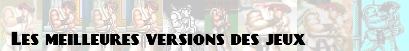

# 

Les meilleures versions des jeux portés de nombreuses fois sur de nombreuses plateformes.

Généralités :

- Sauf exception (notée), les versions Master System et Game Gear sont souvent très proches, mais la Game Gear ayant une résolution inférieure, les jeux sont souvent croppés, la version Master System est donc généralement meilleure.
- Quand un jeu est sorti sur plusieurs ordinateurs, les versions à privilégier sont généralement Amiga, MS DOS, ou Apple II (l'ordre de préférence varie selon les jeux).
- Quand une version ordinateur est supérieure, si une version console correcte existe, elle sera notée, pour la facilité à utiliser sur émulateur (jouable au pad).
- Quand un jeu arcade est supérieur, mais a des portages corrects sur console, les meilleures versions consoles sont notées, parce qu'il y a souvent d'autres options bienvenues (difficulté revue, mode entraînement, etc), et il est plus facile d'acquérir le support original.

**After Burner**  
La version arcade est l'originale, et la référence.  
La version 32X en est un bon portage, avec diverses options de difficulté, mais à 30fps.  
A noter un portage sur 3DS qui apporte un effet 3D.

**Aladdin**  
Les versions SNES et Megadrive sont toutes deux réputées, mais sont totalement différentes et n'ont absolument rien à voir. Jouez aux deux.  
La version Master System/Game Gear est encore différente, mais assez moyenne.

**Another World**  
[Une description des versions par l'auteur du jeu](https://www.anotherworld.fr/anotherworld_uk/page_versions.htm), Eric Chahi.  
La version Amiga est l'originale, mais est mal finie.  
La version DOS est probablement la plus complète.  
Les versions console (MD/SNES) sont artificiellement difficiles, et la version SNES est censurée.  
La version Mega CD a des musiques qualité CD et inclut la suite Heart of the Alien.

**Battletoads**  
C'est le bordel.  
La version originale est sur NES ; le portage sur Megadrive lui est considéré légèrement inférieur, mais est plus joli et moins dur.  
La version Famicom (JP) est sensiblement plus facile, et donc préférable.  
La version arcade n'a absolument rien à voir.

**Bionic Commando**  
La version arcade est trop difficile et pas toujours très bien finie.  
La version NES (US) lui est nettement supérieure, mais est complètement différente (la version Famicom JP est buggée).

**Bomb Jack**  
La version arcade est l'originale, et la référence.  
Attention, Mighty Bomb Jack sur NES n'a strictement rien à voir.

**Boulder Dash**  
La version originale est sur Commodore 64 ; globalement les version ordi sont plutôt bonnes, avec les défauts et qualités classiques de chaque ordi.  
La version NES est très différente, mais assez bonne aussi.

**Bubble Bobble**  
La version arcade est l'originale, et la référence.  
Les conversions NES et Master System sont très bonnes, avec des niveaux supplémentaires (100 en arcade, 112 sur NES, 200 sur MS).

**BurgerTime**  
La version arcade est l'originale, et la référence.  
La version Atari 7800 (Beef Drop) est considérée le meilleur portage, et la version NES correcte.

**Cannon Fodder**  
Si vous utilisez une souris, la version Amiga est l'original, mais la version PC CD-ROM a une cinématique d'introduction.  
Les versions SNES/MD sont correctes mais le contrôle au pad est moyen ; à noter que la version SNES supporte la souris.  
La version 3DO est aussi réputée, mais l'émulation 3DO est encore médiocre de nos jours.

**Castle of Illusion**  
Les versions Megadrive et Master System/Game Gear sont totalement différentes, et n'ont absolument rien à voir. Les deux versions sont bonnes.

**Castlevania/Vampire Killer/Akumajou Dracula**  
La version Famicom Disk System est la version originale, et inclut un système de sauvegarde.  
La version NES est hyper difficile, la version Famicom, sortie plus tard, rééquilibre le jeu, et est probablement la meilleure.  
La version X68000 est un remake très différent, et est jouable sur la version Chronicles sur Playstation avec une version rééquilibrée.

**Choplifter**  
La version Apple II est l'originale, mais la version Master System est considérée la meilleure, avec une mention spéciale pour l'Atari 7800, et la SG-1000.

**Columns**  
La version originale faite par Sega (il y a eu d'autres versions avant) est la version arcade.  
La version Megadrive lui est très fidèle.  
C'est la version Game Gear qui est la plus connue, mais soyons honnêtes, c'est plus parce qu'il était positionné face à Tetris sur une console portable.

**Cool Spot**  
La version Megadrive est supérieure à la version SNES sur quasiment tous les points.

**Dig Dug**  
La version arcade est l'originale, et la référence.  
La version Atari 7800 est considérée comme un bon portage.

**Donkey Kong**  
La version arcade est l'originale, et la référence.  
La version NES lui est très fidèle, mais il manque un niveau, qui a été ajouté sur la version 3DS (virtual console).  
La version Game Boy est totalement différente, et après les 3 premiers niveaux arcade, le jeu ajoute des dizaines de niveaux typés plateforme/puzzle.

**Doom**  
La version originale, et la référence, est sur MS DOS. De nombreux portages open source du moteur existent (PrBoom, ZDoom...) ainsi que des milliers de mods divers et variés.  
La version PS1 est bonne malgré quelques simplifications dans les niveaux.  
La version N64 est très bonne mais c'est une suite.

**Double Dragon**  
La version arcade est l'originale, et la référence.  
La version NES est la plus connue, et introduit un système RPG où l'on doit apprendre les coups spéciaux, mais ne permet qu'un seul joueur.  
La version Megadrive est la plus fidèle à l'arcade (avec un mode 2 joueurs), mais reproduit aussi sa difficulté démente.  
La version Game Boy Advance est un remake avec plusieurs nouveautés (coups, niveaux...).

**Dune**  
La version DOS est l'originale, mais la référence est la version CD-ROM.  
La version Mega CD est correcte mais avec moins de couleurs à l'écran.  
A noter que la version DOS originale sur disquettes suit plutôt le livre, alors que la version CD-ROM suit plutôt le film (avec des extraits de celui-ci).

**Dune 2**  
La version DOS est l'originale, et la référence.  
La version Megadrive est correcte mais il lui manque beaucoup de choses ; le contrôle au pad est moins bon qu'à la souris, mais ça peut être pratique si vous jouez sans souris.

**Earthworm Jim**  
La meilleure version est la Mega CD : mots de passe, musiques CD, plus de niveaux, etc.  
Si vous n'avez pas assez de place pour une ISO, partez sur la version Megadrive.

**Ecco the Dolphin**  
Par rapport à la version Megadrive, le Mega CD apporte de meilleures musiques, quelques niveaux, quelques vidéos, et des correctifs et rééquilibrages.  
La version Master System/Game Gear est honorable mais (forcément) inférieure.

**Elite**  
La version BBC Micro est l'originale, et considérée comme la meilleure par certains, mais la plupart des version sur ordinateur sont bonnes, la version Amiga ayant des graphismes améliorés.  
La version NES, bien qu'inférieure, est honnête.

**Fantasy Zone**  
La version arcade est l'originale, et la référence.  
La version Master System est honnête, mais techniquement largement inférieure.  
La version Sega Ages sur Saturn (et Switch), et la version 3DS, sont "arcade-perfect".  
Un remake est sorti sur Playstation 2 qui change beaucoup de choses mais n'est pas mauvais.  
Un portage sur 3DS existe avec diverses améliorations bienvenues.

**Fatal Fury Special**  
La version arcade/NeoGeo est l'originale, et la référence.  
Les versions Mega CD est honnête, mais le meilleur portage console est sur PC Engine CD.

**Final Fight**  
La version arcade est l'originale, et la référence.  
La version SNES est sensiblement inférieure : il manque le mode 2 joueurs, un perso, un niveau, plus les habituelles régressions techniques.  
La version Mega CD est complète mais graphiquement moyenne, et plus difficile à cause des attaques un peu plus lentes.  
Final Fight One est un remake sur Game Boy Advance, qui inclut tout de l'original et quelques bonus.  
A noter : Mighty Final Fight, une version NES, assez différente mais bonne.

**Flashback**  
La version originelle est la version Mega Drive mais la version Amiga, sortie avant pour des raisons techniques, est aussi excellente.  
La version SNES est n'est pas mauvaise, mais a des différences de couleurs.  
Les versions Mega CD et 3DO apportent des cinématiques en 3D précalculée mais moches, et des musiques qualité CD.

**Flicky**  
La version arcade est l'originale, et la référence.  
La version Megadrive est un très bon portage, très fidèle.  
La version SG-1000 est honorable, considérant les limitations du système.

**Frogger**  
La version arcade est l'originale, et la référence.  
La version Megadrive est la plus fidèle à l'arcade.  
La version Atari 2600 est étonnamment bonne, malgré ses graphismes, heu, d'époque.

**Galaga**  
La version arcade est l'originale, et la référence.  
La version NES est aussi très bonne.  
La version Atari 7800 est honnête mais considérée comme trop facile. A l'inverse, le clone Sega-Galaga sur SG-1000 est sensiblement plus difficile.

**Ghosts n Goblins**  
La version arcade est l'originale, mais est débilement difficile.  
La version NES est la plus connue, mais est tout aussi impossible à terminer.

**Ghouls n Ghosts**  
La version arcade est l'originale, mais est débilement difficile.  
La version Megadrive est un bon portage.  
La version SNES est bonne mais ce n'est pas tout à fait le même jeu.

**Gods**  
La version Amiga est l'originale, et la référence.  
La version Megadrive y est très fidèle, mais la version SNES est plus rapide, ce qui peut être un plus si vous trouver l'original trop lent.

**Gradius/Nemesis**  
La version arcade est l'originale, et la référence.  
La version NES est la plus connue, et plutôt bonne, mais c'est la version PC Engine qui est la plus fidèle.

**James Pond 2 Codename Robocod**  
La version Amiga est l'originale, et la référence.  
Sur console, comme souvent, la version Megadrive a un meilleur gameplay mais une moins bonne technique.  
A noter que le portage sorti sur PS4/XOne/Switch/PC est basé sur la version Playstation, avec d'autres niveaux, moins bons.

**Killer Instinct**  
La version arcade est l'originale, mais c'est la version SNES qui est considérée supérieure au niveau du gameplay, bien que forcément inférieure techniquement.  
Killer Instinct Gold sur N64 est en fait un portage du second épisode.

**Lemmings**  
La version Amiga est l'originale, mais la plupart des versions sur ordinateurs sont identiques ou très proches.  
Sur consoles, les portages SNES et Megadrive sont bons, avec des niveaux supplémentaires (différents) pour chaque version.  
La version Playstation ajoute une vidéo d'intro (moche), en plus des niveaux de "Oh No More Lemmings", et la possibilité de sauvegarder.

**Le Roi Lion**  
Les version SNES et Megadrive sont extrêmement proches, comme souvent avec un meilleur gameplay sur MD et une meilleure technique sur SNES.

**Lode Runner**  
Les versions ordinateur (Apple II, C64, etc) sont les originales.  
L'adaptation SG-1000 est très fidèle.  
La version NES a des moins (ajoute du scrolling) et des plus (graphismes et gameplay améliorés).

**Mappy**  
La version arcade est l'originale, et la référence.  
La version NES est un portage correct.

**Metal Gear**  
La version MSX2 est l'originale, et la référence.  
La version NES est moins complète et plus difficile.

**Mickey Mania**  
La version Megadrive est l'originale, et supérieure en tous points à la version SNES.

**Micro Machines 2**  
La version Megadrive est supérieure à tous les niveaux à la version SNES.

**Might & Magic**  
Les deux premiers épisodes sont plutôt à jouer sur console, les suivants sur plutôt sur ordinateur.

- 1 : sur ordinateur, préférez la version DOS. La version NES a de meilleurs graphismes et une mini-map, mais quelques manques. Il existe un remake sur PC Engine CD mais jamais traduit.
- 2 : sur ordinateur, préférez la version Amiga. Sur console, préférez la version SNES, légèrement censurée mais un peu plus jolie que la version Megadrive. A noter que la version Super Famicom (Japonaise) est totalement différente, avec d'autres graphismes, d'autres musiques, et un système de combat différent.
- 3 : sur ordinateur, préférez la version DOS. Sur console, préférez la version SNES, qui supporte la souris, ou PC Engine CD, avec de meilleures musiques.

Les épisodes suivants ne sont sortis que sur PC (DOS puis Windows).

**Mortal Kombat**  
La version arcade est l'originale, et la référence.  
La version Megadrive est correcte, mais la version Mega CD est encore meilleure, malgré un combat final qui lag. La version SNES est médiocre.  
La version PC-CDROM est excellente mais manque de fluidité quand elle tourne sous DOSBox.

**Mortal Kombat 2**  
La version arcade est l'originale, et la référence.  
Cette fois-ci c'est la version SNES qui est supérieure à la version Megadrive, mais pas de beaucoup.  
En revanche, la version Sega 32X est encore meilleure, et quasiment "arcade-perfect".

**Mortal Kombat 3/Ultimate Mortal Kombat 3**
Les versions arcade sont les originales, et les références.  
Les versions SNES sont aussi correctes que pour MK2, en revanche les versions Megadrive sont moins bonnes cette fois-ci.  
La version DS de UMK3 est quasiment arcade-perfect, et inclut en plus le mode "puzzle kombat".

**Ninja Gaiden/Shadow Warrior**  
Accrochez-vous bien.
La version arcade est un beat'em up, honnêtement pas terrible, et porté correctement sur Amiga.  
La version NES, développée en parallèle, est un platformer très difficile, typique de cette époque, et très bon. Il a été refait sur SNES dans la Ninja Gaiden Trilogy, plus joli, moins précis, avec des mots de passe.  
La version Master System est bonne mais encore différente, et plutôt une suite des épisodes NES.  
La version Game Gear est encore différente, mais pas terrible cette fois-ci.  
La série est revenue sur Xbox, mais n'a plus rien à voir.

**OutRun**  
La version arcade est l'originale, et la référence, mais est difficile à émuler à cause des contrôles.  
La version Master System est honnête, mais la Game Gear est mauvaise.  
La version Megadrive est très correcte, avec quelques bonus.  
La version arcade a été portée à l'identique sur de nombreuses plateformes, de la Saturn à la Switch, avec souvent des bonus.

**Pac-Man**  
La version arcade est l'originale, et la référence.  
La version NES est très correcte.  
Les versions Atari 5200/800/400 sont aussi très fidèles à l'original.  
La version arcade a été portée à l'identique sur environ un million de plateformes depuis.

**Paperboy**  
La version arcade est l'originale, et la référence, mais est difficile à émuler à cause des contrôles.  
La version la plus connue est probablement sur Master System, mais la version Megadrive, assez confidentielle, est aussi assez bonne.

**Parodius Da!**  
La version arcade est l'originale, et la référence.  
La version SNES lui est assez fidèle, à part quelques ralentissements. Pour une fois dans cette série, la version PC Engine lui est inférieure.  
La version NES est honnête mais il manque plusieurs niveaux, remplacés par un niveau exclusif.

**Populous**  
Les versions Amiga et Atari ST sont les originales, et les références.  
La version DOS a moins de problèmes techniques mais des sons et musiques de moins bonne qualité.  
Sur console, la version SNES est la meilleure, même si la version Master System est correcte, et a 4500 (!!!) niveaux supplémentaires.

**Prince of Persia**  
La plateforme d'origine est l'Apple II ; les versions DOS, Amiga et Atari ST sont aussi très bonnes.  
La version PC Engine est bonne, et est basée sur les portages sur les ordinateurs Japonais, notamment NEC-PC98.  
En 8 bits, la version Master System est supérieure à la version NES, et relativement fidèle aux version ordi.  
La version Megadrive est moyenne, avec de jolis graphismes mais des combats mal faits.  
La version Mega CD n'a rien à voir avec la version Megadrive, elle est plutôt basée sur la version PC Engine, en y rajoutant des cinématiques.  
La version SNES est une très bonne version, mais radicalement différente, avec de nouveaux niveaux, des niveaux refaits parfois totalement, des combats différents, etc.  
A noter qu'un remake en 2.5D a été fait sur Xbox 360/PS3, plutôt correct.

**Puyo Puyo**  
L'original est sur MSX2 & Famicom, mais n'est pas la meilleure version.  
La version arcade est celle qui a "lancé" la série, mais les version console sont généralement "arcade perfect", notamment parce que la version arcade a été développée en réfléchissant dès le début aux portages.  
La version PC Engine est probablement la meilleure, notamment grâce à ses performances sonores.  
Les versions Megadrive, Master System et Game Gear sont appelées Dr Robotnik Mean Bean Machine, et sont juste des reskins de l'original.  
La version SNES est Kirby's Avalanche (US)/Kirby's Ghost Trap (EU), et ont des changements (cosmétiques) plus profonds.

**R-Type**  
La version arcade est l'originale, et la référence.  
La version Master System est honorable, mais la version PC Engine R-Type Complete CD (sur PC Engine CD) est très proche de l'arcade.  
Il est disponible en version "presque parfaite" sur R-Types (avec un S) sur Playstation, avec une sauvegarde de la progression.  
R-Type Dimensions est un remake 2.5D des deux premiers sur Xbox 360/PS3.

**R-Type 2/Super R-Type**  
La version arcade est l'originale, et la référence.  
La version SNES est bonne bien que très différente, mais aussi très difficile car il n'y a plus de checkpoint.  
La version Amiga est aussi très correcte, bien qu'ayant plus de ralentissements.  
Il est disponible en version "presque parfaite" sur R-Types (avec un S) sur Playstation, avec une sauvegarde de la progression.  
R-Type Dimensions est un remake 2.5D des deux premiers sur Xbox 360/PS3.

**Rampage**  
La version arcade est l'originale, et la référence.  
La version Master System est un très bon portage.  
La version "World Tour" sur N64 est aussi très populaire.

**Renegade**  
La version arcade est l'originale, mais ce n'est pas la meilleure.  
Les version NES et Master System, très proches, sont préférées.  
La version Amiga/Atari ST est honnête.

**Road Rash**  
La version Megadrive est l'originale, et la plus connue, mais pas forcément la meilleure.  
La version Mega CD apporte des cinématiques et des musiques de qualité CD.  
La version présente sur 3DO, Playstation, Saturn et Windows est considérée comme la meilleure.

**Samurai Shodown**  
La version arcade (NeoGeo) est l'originale, et la référence.  
La version Megadrive est honnête malgré toutes les modifications, mais difficile à contrôler au pad 3 boutons.  
La version Mega CD est largement supérieure, mais pas encore parfaite.  
La version SNES fait trop de compromis à tous les niveaux pour être conseillée.  
La version Playstation (dans la compilation Samurai Spirits Kenkaku Shinan) est quasiment "arcade-perfect".

**Sensible Soccer**  
La version Amiga/Atari ST/DOS est l'originale, et la référence.  
La version SNES/Megadrive est très fidèle, la version SNES ajoutant une sauvegarde, notamment pour l'édition des équipes.  
La version Mega CD y apporte quelques améliorations.

**Shinobi**  
La version arcade est l'originale, et la référence.  
La version Master System, bien que sensiblement différente, est aussi très bonne.  
La version Game Gear est totalement différente et n'a rien à voir, étant plutôt inspirée par les épisodes Megadrive.  
A noter une version Sega Ages sur Switch, portage de l'arcade avec quelques réglages bienvenus.

**Sid Meier's Pirates!/Pirates! Gold**  
La version Commodore 64 est l'originale, et la référence.  
La version NES est un bon portage.  
La version Gold sur Megadrive est aussi très bonne, plus jolie, mais avec des contrôles légèrement inférieurs.

**Sim City**  
Le jeu a subi un développement long et complexe : développé d'abord pour Commodore 64, c'est la version Amiga et DOS qui est sortie en premier.  
La version DOS est la meilleure du lot.  
La version SNES est sensiblement différente, mais est aussi très bonne.  
A noter que le code source est passé sous GPL, vous pouvez donc jouer au jeu gratuitement, sous le nom de Micropolis.

**Sonic the Hedgehog**  
Tout le monde connaît bien sûr le Sonic de la Megadrive, mais la version Master System est notable pour être totalement différente mais quand-même très bonne.

**Space Invaders**  
La version arcade est l'originale, mais pas la meilleure.  
La version Atari 2600 y apporte des améliorations, comme de nouveaux modes de jeu.  
La version NES est aussi très fidèle, et inclut Space Invaders Part II.  
La version SNES permet de choisir la version reproduite.  
Mention spéciale à la version SG-1000, presque arcade-perfect malgré les restrictions du système.

**Speedball 2**  
La version Atari ST est l'originale, et la référence.  
La version Amiga est sensiblement identique.  
La version Megadrive est aussi très proche mais légèrement inférieure, notamment au niveau sonore.

**Street Fighter 2 (toutes variantes)**  
Les versions arcade sont les originales, et les références. Elles ont été portées sur diverses compilations depuis la Saturn/Playstation.  
Special Champion Edition sur Megadrive est très bon, et inclut les éléments de Turbo/Hyper Fighting.  
Turbo/Hyper Fighting sur SNES est très bon, et inclut la Champion Edition (oui c'est n'importe quoi).  
La version PC Engine de Champion Edition est remarquablement fidèle à l'arcade, mais n'inclut pas les nouveautés de Turbo (vitesse accélérée, nouveaux coups).  
Super SF2 est légèrement supérieur sur SNES mais pas de beaucoup. Sur Megadrive, les puristes préfèrent la Special Champion Edition.  
Conclusion : Special Champion Edition sur Megadrive, Super sur SNES.  
A noter que toutes les versions arcade sont incluses dans la 30th Anniversary Collection sur PS4/XOne/Switch.

**Street Fighter Alpha (tous numéros)**  
Les versions arcade sont les originales, et les références.  
La version Playstation de Alpha 3 est probablement la plus populaire, mais c'est la version Saturn qui est la plus fidèle et la plus complète.  
La version SNES de Alpha 2 est remarquable, même si nécessairement largement inférieure techniquement.  
La version GBA de Alpha 3 est correcte.  
A noter que toutes les versions arcade sont incluses dans la 30th Anniversary Collection sur PS4/XOne/Switch.

**Strider**  
La version arcade est l'originale, et la référence.  
La version Megadrive est excellente et très fidèle malgré quelques concessions.  
La version PC Engine est techniquement nettement inférieure, mais a quelques ajouts : un niveau, des cinématiques, des musiques, etc.  
Un portage arcade-perfect existe sur Playstation.

**Kick Off 2/Super Kick Off**  
La version originale est sur Amiga/Atari ST.  
La version Master System est un portage correct, mais forcément restreint techniquement.  
La version Megadrive est sensiblement différente, et notamment plus rapide.

**Syndicate**  
Les versions Amiga/DOS sont les originales, et les références.  
Les versions 3DO et Jaguar sont très fidèles aux originaux, mais difficiles à contrôler sans souris.  
Les versions SNES/Megadrive/Mega CD sont totalement différentes (graphismes, contrôle, niveaux...), et pas très bonnes.

**TMNT Arcade Game**  
La version arcade est l'originale, et la référence.  
La version NES est correcte, et compense le downgrade graphique par de nouveaux niveaux et ennemis.  
Hyperstone Heist sur Megadrive utilise (entre autre) les niveaux de The Arcade Game.

**TMNT Turtles in Time**  
La version arcade est l'originale, mais pas la meilleure.  
La version SNES est supérieure en quasiment tous points, il manque surtout le mode 4 joueurs.  
Hyperstone Heist sur Megadrive utilise (entre autre) les niveaux de Turtles in Time, ainsi que les sprites et les contrôles.

**Tetris**  
Tetris a une histoire longue et tortueuse, a subi de nombreuses batailles sur les droits de publication, et plusieurs changements de règles depuis ses origines.  
La version la plus connue est la version Game Boy, et elle est très bonne, mais ce n'est pas la meilleure.  
Tetris DS est souvent considéré comme une des meilleures versions sur console.  
Tetris Battle Gaiden sur SNES offre un mode versus comparable à Puyo Puyo.  
Tetris The Grand Master 3 sur arcade est une version survitaminée et largement considérée comme excellente.  
Tetris continue à sortir sur différentes plateformes, les plus notables récemment étant Puyo Puyo Tetris, Tetris Effect sur PS4 VR, et Tetris 99 sur Switch.

**The Chaos Engine**  
La version Amiga est l'originale, et la référence.  
La version SNES a un framerate plus stable que la version Megadrive, qui est supérieure sur les autres points.

**Theme Park**  
Les versions Amiga et DOS sont les originales, et les références.  
Les versions 16 bits (Megadrive/SNES) sont simplifiées, ont plus d'attractions, mais ne supportent pas les sauvegardes, remplacées par système de mots de passe quand on vend son parc.  
La version Playstation est considérée très bonne, avec une bonne technique, de bons contrôles, et la sauvegarde, plus un mode de visite du parc à la première personne.  
A noter une version spéciale "Shin Theme Park" exclusive au Japon et totalement refaite, et un remaster/remake sur DS avec diverses qualités et défauts.

**Ultima (série)**  
Accrochez-vous.  
Les épisodes 1 à 5 sont d'abord sortis sur Apple II, mais ce n'est pas toujours la meilleure plateforme.  
Les épisodes 6 et ultérieurs sont développés sur DOS (puis Windows), qui sont les versions supérieures.  
La série a été très populaire au Japon, et est disponible, parfois en version supérieure, sur ces machines, qui sont mal émulées et difficiles d'accès. Les versions FM Towns sont souvent superbes.  
Les versions 2 à 5 sur DOS ont divers problèmes, mais des patchs fan-made les rendent supérieures aux autres. Ces patchs sont cependant difficiles à appliquer de nos jours.  

- 1 : préférez la version First Age of Darkness sur Apple II, DOS ou Commodore 64.
- 2 : préférez la version Apple II, Commodore 64 ou Atari 8 bits.
- 3 : préférez la version Amiga. La version NES a de nombreux problèmes, mais a l'avantage de se jouer sans clavier.
- 4 : préférez la version Amiga. La version NES est mieux que l'épisode 3, mais reste largement inférieure. La version Master System est très fidèle à l'original, mais n'a pas les donjons à la première personne.
- 5 : préférez la version Amiga, ou Atari ST qui a plus de musiques. La version NES est notoirement mauvaise.
- 6 : préférez la version DOS. La version SNES est correcte.
- 7 Part I : préférez la version DOS, même si elle n'est pas facile à faire tourner. La version SNES est notoirement mauvaise.

Les versions 7 Part II et ultérieures ne sont sorties que sur PC (DOS puis Windows).

**Wing Commander**  
La version DOS est l'originale, mais est notoirement difficile à émuler.  
La version Amiga est identique, à l'exception des couleurs réduites.  
La version SNES est honnête malgré les concessions techniques.  
La version 3DO est un remake complet, et largement supérieur même si très différent.

**Wizardry (série)**  
Encore une série avec beaucoup de versions, dont beaucoup ne sont sorties qu'au Japon.

- Les épisodes 1 à 7 sont disponibles sur DOS dans la compilation Ultimate Wizardry Archive.
- 1/2/3 : préférez la version Playstation/Saturn (Llylgamyn Saga) ou même, étonnamment, la version SNES (Story of Llylgamyn) qui lui est supérieure.
- 4/5 : préférez la version Playstation (New Age of Llylgamyn).
- 6 : préférez la version SNES avec une traduction fan-made.
- 7 : préférez la version DOS

**Wonder Boy**  
La version arcade est l'originale, et la référence.  
Le portage sur Master System est le plus connu, et le meilleur.  
Sur NES, il est sorti sous le nom de Adventure Island.  
Un remake appelé Wonder Boy Returns est sorti sur PS4/XOne/Switch/PC, mais n'apporte rien.

**Wonder Boy in Monster Land**  
La version arcade est l'originale, mais est incroyablement frustrante.  
Le portage Master System est correcte mais très difficile car n'a pas de continue.  
La version PC Engine est fidèle à l'arcade et inclut des continues infinis avec un code.

**Wonder Boy III The Dragon's Trap**  
La version originale est la Master System, mais la version PC Engine lui est légèrement supérieure.  
A noter l'excellent remaster sorti sur PS4/Xbox One/Switch/PC, qui est la meilleure manière de jouer au jeu, et de loin.

**Ys**  
Les épisodes après le 6 ne sont plus vraiment du rétrogaming.

- 1 & 2 : préférez la version PSP/PC, ou à défaut la PC Engine CD.
- 3 : préférez la version PSP/PC (Oath In Felghana), ou à défaut la PC Engine.
- 4 : préférez la version PS4/Vita/PC (Memories of Celceta). Les versions originales (Mask of the Sun et Dawn of Ys) n'ont jamais été localisées.
- 5 : n'a jamais été localisé. Si vous trouvez une fantrad, elle sera probablement pour la version SNES.
- 6 (Ark of Napishtim) : préférez la version PC.
