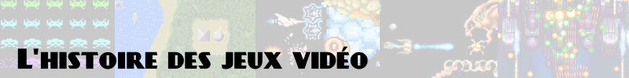

# 

L'idée est d'essayer de retracer l'histoire des jeux vidéo, avec les origines, les références, les influences, etc, mais sans forcément rentrer dans le détail.

L'objectif est de proposer une liste des titres marquants et influents, et de mettre en avant quelques **titres indispensables** (marqués :star: ) pour comprendre l'évolution de chaque genre, pour ceux qui veulent retracer l'évolution de ces jeux eux-même, sans forcément que ce soient les meilleurs jeux aujourd'hui d'ailleurs, mais surtout les **jeux les plus influents**.

Les historiques sont divisés grossièrement par genre, mais tout se mélange un peu, avec des jeux qui influencent ou créent d'autres genres, des jeux influents mais d'un genre unique, des jeux qui mélangent plusieurs genres, etc. Ce n'est donc pas tant une stricte séparation qu'un moyen de faciliter la lecture.

## Jeux occidentaux et jeux Japonais

On notera dans beaucoup de genres une distinction forte entre les jeux occidentaux et les jeux Japonais. La distinction s'explique avec deux facteurs principaux : les différences culturelles, mais aussi les différences techniques des supports utilisés.

Niveau culturel, outre les sensibilités différentes, au niveau de la violence et du sexe par exemple, il y a aussi les influences des produits culturels et commerciaux disponibles et populaires durant certaines périodes. Les mangas sont un exemple évident : ils sont très populaires au Japon dès les années 60, mais virtuellement inconnus aux USA avant le milieu des années 90, et très peu populaire en Europe excepté en France (ce qui fait que par exemple, certains jeu Dragon Ball Z sont sortis uniquement au Japon et en France). L'influence des mangas sur les jeux vidéo Japonais est évidente dès le début, aussi bien dans le style graphique que dans les histoires, alors que l'occident reste très ancré dans ses propres traditions pendant longtemps.

De même, les "jeux de rôle" sont populaires en occident depuis des dizaines d'années, avec par exemple les reconstitutions médiévales ; les romans d'heroic fantasy comme Le Seigneur des Anneaux sont également très populaires dans les années 60. Donjons & Dragons, le jeu de rôle papier, est sorti en 1974 aux USA et connaît un succès toujours grandissant à la fin des années 70 et au début des années 80, mais n'est pas traduit au Japon avant 1985 et n'y connaîtra pas le succès avant plusieurs années, alors que les Japonais ont déjà créé leurs propres styles de jeux de rôle. D&D a donc une influence énorme sur les RPG occidentaux, et minime sur les RPG Japonais.

Par ailleurs, les machines utilisées divergent radicalement en occident et au Japon. Outre les marques présentes uniquement sur certains continents, pour afficher des caractères Japonais de manière lisible, les PC occidentaux de l'époque, avec leur résolution généralement de 320x200, ne suffisent pas. Les PC Japonais ont donc, dès le début, des résolutions largement supérieures, généralement du 640x400. Ils peuvent afficher des images de qualité largement supérieure, et ne s'en privent pas.

Enfin, on notera également une simple préférence pour certains types de jeux ou sujets d'un côté ou de l'autre de l'océan. Les shmups sont créés en très large majorité par des studios Japonais, alors que les jeux de course ou de simulation sont plus appréciés en occident, par exemple.

---

## Shmups

Les shmups (shoot'em up) ont une histoire assez simple et "linéaire". Les jeux qui marquent vraiment un tournant sont **Space Invaders**, **Gradius** qui marque l'arrivée des powerups, et **Batsugun SP** qui amorce les bullet hell.

**Spacewar!** (1962) est **un des premiers jeux vidéo** jamais créés. C'est un shoot multijoueur, où les vaisseaux se dirigent comme dans Asteroids, et est étonnamment complexe : les joueurs doivent gérer leurs munitions, leur carburant, et la gravité des étoiles. Il a été développé sur PDP-1, un "mini-ordinateur" d'environ 2 mètres de haut et vendu à 50 exemplaires. Il n'était évidemment disponible qu'aux quelques académiciens et chercheurs qui avaient accès à cette machine, mais son influence est considérable, et sa popularité non négligeable.

**Computer Space** (1971, Syzygy) est globalement une repompe simplifiée de Spacewar! : il retire les munitions et le carburant, et rajoute des **ennemis qui tirent** sur le joueur. C'est le **premier jeu vidéo commercial**, et la **première borne d'arcade**. Il n'a pas été un succès retentissant, mais a lancé les idées à la fois des jeux vidéo en tant que produit commercial, et des bornes d'arcade avec hardware dédié. Le concept sera repris et amélioré, avec succès cette fois, dans **Asteroids** (1979, Atari).

:star: **Space Invaders** (1978, Taito) est le **premier jeu vidéo arcade à succès retentissant**. Il crée ou rend populaire de nombreuses choses reprises partout depuis : les **vies multiples**, le **high score** qui reste mémorisé, les **ennemis avec de vrais sprites** et une certaine "personnalité", une **difficulté croissante** avec les ennemis qui accélèrent, une **musique de fond**, etc. C'est aussi le premier jeu vidéo qui aura **de nombreux clones**.

**Galaxian** (1979, Namco) reprend le principe de Space Invaders, et y ajoute des **ennemis qui "cassent" la formation** pour descendre sur le joueur, avec des **ennemis aux comportements différents**, et des **tableaux différents** ; sa suite :star: **Galaga** (1981), similaire mais plus moderne et dynamique, est bien plus connue.

**Ozma Wars** (1979, SNK) est le premier jeu avec une **barre de vie**, ainsi qu'un des premiers jeux à **scrolling**, bien que celui-ci soit uniquement un effet visuel.

:star: **Defender** (1981, Williams) est le premier shmup à **scrolling libre**, et aussi un des premiers à avoir une **mini-map**.

**Scramble** (1981, Konami) n'est pas très connu par le grand public, mais c'est pourtant une étape importante dans l'histoire des shmups : c'est le premier shmup à **scrolling automatique**, et qui a de **multiples niveaux** avec des styles visuels différents, soit la base de tous les shmups modernes.

**Vanguard** (1981, SNK) alterne **scrolling horizontal et vertical**, et reprend les contrôles aux doubles sticks de Gun Fight et Sheriff pour pouvoir tirer dans toutes les directions.

**Bosconian** (1981, Namco) est le premier shmup à **déplacement libre**, où l'on peut explorer la carte à loisir, finalement assez peu exploré dans le genre des shmups, et repris par **Time Pilot** (1982, Konami).

:star: **Xevious** (1982, Namco) n'est que moyennement connu, mais est extrêmement influent, en mélangeant un **scrolling forcé vertical**, des **niveaux distincts visuellement**, des **arrière-plans détaillés**, **deux niveaux d'attaque** (sol/air), une **IA adaptative**, et des **boss de fin de niveau**. Ce n'est pas toujours le premier à créer chacune de ces choses, mais c'est le premier à tout mélanger, et devient en ce sens la "formule de base" des shmups à venir.

**Zaxxon** (1982, Sega) est le premier shmup **isométrique**, style très peu fréquent dans le genre ; on pourra noter **Desert Falcon** (1987, Atari) ou **Viewpoint** (1992, Sammy).

**Moon Patrol** (1982, Irem) est le premier jeu à introduire du **scrolling parallaxe** pour introduire une impression de profondeur.

:star: **1942** (1984, Capcom) introduit le concept de **powerups** qui apparaissent suite à la destruction de certains ennemis.

:star: **Gradius** (1985, Konami) est extrêmement influent, en combinant d'excellente manière bon nombre de concepts déjà existants, mais c'est surtout le premier qui a des **powerups réellement différents**, là où les précédents se contentaient d'améliorer la puissance de feu du joueur. Il laisse d'ailleurs le **choix des powerups**, permettant ainsi à chacun de jouer de la manière qu'il le souhaite.

**TwinBee** (1985, Konami) est le premier jeu d'un genre depuis appelé **"cute'em up"** : un shoot'em up, mais mignon et rigolo. Il inspirera plusieurs successeurs, dont **Fantasy Zone** (1986, Sega), ou **Parodius** (1988, Konami).

**Zanac** (1986, Compile) n'innove pas réellement, mais perfectionne un **système avancé de powerups** pour leur donner une identité propre, qui sera repris dans de nombreux shmups du développeur, dont la série **Aleste / Power Strike** (1988, Compile).

**Star Soldier** (1986, Hudson Soft) introduit le concept d'un **"caravan mode"**, une course au high score très courte et technique, système souvent utilisé en compétition depuis.

:star: **R-Type** (1987, Irem) ne révolutionne rien, mais transforme un style de jeu traditionnellement extrêmement nerveux et basé sur les réflexes, en jeu **lent et méthodique**, et crée ainsi sa propre "branche".

**Batsugun** (1993, Toaplan) et notamment sa "Special Version" (prototype non commercialisé) est généralement considéré comme étant l'origine du style **bullet hell/danmaku**, où l'on se concentre plus sur l'évitement des balles que viser les ennemis, avec notamment une **hitbox réduite** qui permet de se faufiler entre les balles. Il inspirera notamment :star: **DonPachi** (1995, Cave), et les jeux de la série **Touhou** (1997, divers).

**Twinkle Star Sprites** (1996, SNK) est le premier jeu à proposer un **mode versus**, chose qui reste malheureusement assez rare, et des **éléments de puzzle game**.

**Radiant Silvergun** (1998, Treasure) est considéré comme un des meilleurs shmups jamais créés, et le **modèle des shmups modernes**. Il est suivi par **Ikaruga** (2001, Treasure), autre référence du genre, qui mélange du puzzle.

### Twin stick shooters

Dérivés des shmups, les twin stick shooters sont caractérisés notamment par la possibilité de se déplacer et de tirer dans n'importe quelle direction.  
Le genre a connu un certain succès dans les années 80, puis est totalement tombé à l'abandon jusqu'à l'apparition des consoles à double stick standards, notamment sur la génération PS3/Xbox 360 où le genre est revenu en force.  
A noter que "twin stick shooter" est une appellation récente apparue car on utilise les deux sticks analogiques des consoles modernes ; les jeux plus anciens n'utilisaient pas forcément deux sticks.

Les tous premiers shmups sont en fait déjà une "forme primitive" des twin stick shooters : **Spacewars!**, **Computer Space** et **Asteroids** permettent déjà de se déplacer librement et de tirer à 360°, de même que **Bosconian**, qui y rajoute une composante d'exploration.

**Gun Fight / Western Gun** (1975, Taito) est très peu connu, mais c'est le **premier véritable twin stick shooter** (un contrôle pour le personnage, un contrôle pour orienter le tir), le **premier jeu avec des armes réelles**, et le **premier jeu qui fait s'affronter des humains**.

**Sheriff** (1979, Nintendo) y ajoutera la possibilité de **se déplacer librement**.

**Berzerk** (1980, Atari) est un des premiers jeux (mais pas le premier) avec de la **synthèse vocale**, et a été une grosse influence sur :star: **Robotron 2084** (1982, Williams), qui est le **premier jeu populaire** dans le genre. **Smash TV** (1990, Williams), autre grand succès, repompe totalement la formule mais dans un environnement dystopique.

:star: **Gauntlet** (1985, Atari) reprend le concept mais en mode RPG/hack & slash medieval fantastique, et c'est le premier jeu du genre à être **jouable à 4 joueurs en simultané**.

**Commando** (1985, Capcom) est un des premiers jeux du genre à utiliser un **environnement moderne et réaliste** suite à la sortie et au succès du film Rambo la même année.

**Ikari Warrior** (1986, SNK) est le premier jeu à utiliser des **joysticks rotatifs** (rotary sticks).

### Rail shooters et light gun

Les rail shooters sont une forme de shmup dans lequel le scrolling se fait "en profondeur", et le joueur avance "dans" l'image.

**Radar Scope** (1980, Nintendo) est le premier shooter qui introduit une **perspective en profondeur**, mais il n'y a pas encore de scrolling.

:star: **Tempest** (1981) est le premier **"tube shooter"**, avec des ennemis qui nous arrivent dessus avec un effet de perspective, mais il n'y a un scrolling qu'entre les tableaux.

**Star Wars** (1983, Atari) est un des premiers **véritables rail shooters**, et aura un **énorme succès commercial**.

:star: **Space Harrier** (1985, Sega) introduit une pseudo-3D simulée par du **sprite scaling** et une **borne rotative sur vérins**, technologies qui seront aussi utilisées par **After Burner** (1987, Sega).

**Starblade** (1991, Namco) est le premier shooter en **3D polygonale texturée**.

:star: **Star Fox** (1993, Nintendo) est le premier shooter avec une **véritable histoire mise au premier plan**, alors qu'elle servait surtout de prétexte auparavant.

On pourra noter également **Panzer Dragoon** (1995, Sega), **REZ** (2001, Sega), ou encore **Killer 7** (2005, Capcom).

### Light gun

Les jeux au "light gun", où l'on utilise des pistolets pour viser et tirer directement sur l'écran, ont leurs racines dans les jeux électromécaniques, qui utilisaient des "pistolets à lumière" et des capteurs. Nintendo était parmi les premiers à utiliser cette technologie en 1970, leur dernier jeu du genre s'appelant... Duck Hunt (1976).  
Nombre de jouets et de jeux d'arcade utilisent ces systèmes dans les années 70 et 80, mais aucun n'a connu un succès notable, et tous sont très basiques. On notera surtout **Wild Gunman** (1974, Nintendo) qui projette un film (en 16mm) sur un écran durant la partie.  
Ce n'est qu'avec l'arrivée des jeux vidéo plus modernes que le genre devient véritablement populaire.

**Duck Hunt** (1984, Nintendo) est le **premier jeu populaire** dans le genre, son existence en tant que jeu de lancement souvent en bundle avec la NES n'y étant probablement pas étranger.

**Operation Wolf** (1987, Taito) est le premier qui a un **scrolling automatique** avec des **ennemis qui apparaissent soudainement**, et définit donc la formule pour tous les jeux du genre à venir. Il sera copié par de nombreux jeux, dont **Alien Brigade** (1990, Atari).

**Lethal Enforcer** (1992, Konami) utilise des **photos de personnes et environnements réels** et déclenche une polémique car le jeu vidéo devient "trop réaliste".

**Virtua Cop** (1994, Sega) est le premier jeu du genre en **3D polygonale**, et qui **localise les dégâts**, en plus de **signaler l'arrivée des ennemis**.

Le genre connaît une vague de popularité dans les années 90, avec notamment **Time Crisis** (1995, Namco) et **House of the Dead** (1996, Sega), puis s'arrête assez brutalement à l'apparition des télés à écrans plats, qui ne permettent plus d'utiliser cette technologie.

Tant que la technologie du "light gun" n'était pas assez fiable pour les jeux d'arcade, certains jeux "trichent", en utilisant un trackball ou un joystick pour déplacer un curseur à l'écran, souvent en "déguisant" ce joystick en arme : ce sont les "fixed guns".

**Cabal** (1988, Taito) est le premier qui mélange shmup (**déplacement d'un personnage** qui évite les tirs) et ce système de **déplacement de curseur à l'écran**, avec un trackball.

Plusieurs jeux console reprennent le concept, notamment **Nam 1975** (1990, SNK) et **Wild Guns** (1994, Natsume), mais avec un seul contrôle qui alterne entre déplacement et tir.

**Terminator 2 Judgement Day** (1991, Midway) est le premier qui **déguise son joystick en arme**, ce qui sera copié par **Alien 3 The Gun** (1993, Sega).

---

## Jeux d'aventure

Tout comme les shmups, l'origine des jeux d'aventure peut être retracée aux ordinateurs "mainframe" de plusieurs tonnes trouvables dans les universités et centres de recherche. Leur disponibilité est donc très réduite, mais leur influence est tout aussi considérable.

## Jeux textuels, point & click

Sauf exception, tous ces jeux d'aventure sont sortis sur les PC de l'époque.

**Colossal Cave Adventure** (1976, PDP-10) puis :star: **Zork** (1977, PDP-10) étaient les premiers **jeux d'aventure purement textuels**, où l'on tapait des commandes pour pouvoir avancer.

**Mystery House** (1980) est le premier jeu d'aventure textuel qui **affiche des illustrations**, certes rudimentaires.

:star: **King's Quest** (1984) est le premier jeu d'aventure avec des **animations**, notamment du personnage, et c'est aussi le **premier grand succès commercial**.

**Enchanted Scepters** (1984) est le premier à utiliser une interface **point & click**, c'est la fin des jeux purement textuels, du moins au niveau commercial.

**Adventure Construction Set** (1985) est le premier **moteur de construction de jeux d'aventure** vendu commercialement.

:star: **Déjà Vu** (1985) est le premier jeu qui permet de faire du **drag & drop**.

:star: **Maniac Mansion** (1987) revoit l'interface avec un **système verbe/objet**, repris un peu partout ensuite.

**Shadowgate** (1987) est un jeu notable pour sa **grande difficulté**, avec des milliers de possibilités de mourir, et parfois **plusieurs solutions aux puzzles**.

**Quest For Glory/Hero's Quest** (1989) se joue comme les autres jeux d'aventure Sierra, mais **inclut des éléments de RPG** : classes qui influent sur les quêtes accessibles et la résolution des puzzles, statistiques, expérience et niveaux, ainsi qu'un cycle jour/nuit et la nécessité de manger.

:star: **The Secret of Monkey Island** (1990) est le premier jeu utilisant le **moteur SCUMM** réutilisé sur tous les jeux d'aventure Lucas Arts pendant des années. C'est aussi le premier jeu d'aventure où il est **impossible de perdre** (à une exception près), ce qui marque un changement radical dans l'approche de ces jeux. Enfin, il est parmi les premiers à avoir un **arbre de dialogue**.

:star: **Myst** (1993) introduit un concept de **narration environnementale sans texte** en étant **centré sur les puzzles**, et c'est le **premier jeu distribué uniquement sur CD-ROM**. C'est aussi un jeu qui contribue à changer la perception des "jeux vidéos pour enfants", en touchant aussi un **public plus large et plus âgé**.

**Under a Killing Moon** (1994) est le premier **point & click FMV**, même si ce n'est pas le premier jeu FMV, genre inventé dans les années 70 et prolifique dans les années 80 sur LaserDisc. Il sera suivi par une litanie de jeux du genre jusqu'à la fin des années 90 et l'arrivé massive de la 3D temps réel.

:star: **Snatcher** (1994, Mega CD) est localisé pour la première fois, et **introduit l'occident aux visual novels Japonais**.

**Grim Fandango** (1998) est le premier jeu d'aventure avec de la **3D polygonale temps réel** pour les personnages et objets.

:star: **Fahrenheit** (2005, Playstation 2) est le premier jeu d'aventure qui fonctionne principalement **à base de quick time events**, et préfigure l'évolution du genre vers des jeux où l'on interagit avec une histoire qui nous est racontée, plutôt que d'être un véritable acteur.

A voir aussi : **Space Quest** (1986), **Leisure Suit Larry** (1987), **Police Quest** (1987), **Indiana Jones** (1989), **Gabriel Knight** (1993), **Sam & Max Hit The Road** (1993), **Full Throttle** (1995), **Blade Runner** (1997)

### Visual novels

Les jeux d'aventure ont connu une évolution parallèle en occident et au Japon, avec très peu d'influence les uns sur les autres : les objectifs sont similaires, mais les moyens sont totalement différents. Notamment, les PC Japonais ont une résolution très largement supérieure, nécessaire pour afficher les caractères Japonais de manière lisible, et souvent beaucoup plus de couleurs affichables. La différence en terme de capacités graphiques permet donc aux Japonais d'avoir des jeux d'aventure avec d'immenses images magnifiques et un peu de texte, alors que les jeux occidentaux doivent souvent se contenter de texte agrémenté d'une image moche.

**Night Life** (1982) et **Seduction of the Condominium Wife** (1982) sont des jeux d'aventure, parfois avec quelques éléments RPG, et ont du **contenu érotique**, et marqueront les débuts d'une longue tradition Japonaise d'inclusion d'érotisme dans leurs jeux d'aventure.

:star: **Portopia Serial Murder Case** (1983) est un jeu **majeur et fondateur du genre**. Son déroulement est **non linéaire**, avec un **open world** à explorer, des **mystères à résoudre**, de **nombreux PNJ**, des **dialogues à embranchements**, et de **multiples fins**. La version Famicom (1985) ajoute un curseur qui permet de **chercher des hotspots**, comme les point & click de l'époque.

**Spy 007** (1983) apporte une **interface à menus déroulants** qui remplace l'entrée de texte, et qui sera **utilisé partout** à cette époque.

**Planet Mephius** (1983) est le **premier point & click Japonais**, un an avant Enchanted Scepter en occident.

**Will: The Death Trap II** (1985) est le premier jeu Japonais d'aventure sur ordinateur avec des **images animées**.

**Suisho no Dragon** (1986, Famicom) affiche également des images animées, mais surtout des **menus avec des icônes plutôt que du texte**.

:star: **J.B. Harold Murder Club** (1986) innove avec un **système de multiples réponses** avec des **tons et objectifs différents** (agressif, amical, etc). Ce sera le premier épisode de la **série la plus vendue** dans le genre.

**Reviver: The Real-Time Adventure** (1987) se déroule en **temps réel**, avec un **cycle jour/nuit**, et des **PNJ qui vivent leur vie** et ne sont pas toujours disponibles.

:star: **Snatcher** (1988), réalisé par le fameux Hideo Kojima, a une **réalisation de très haute qualité** technique, un **excellent scénario**, des **doublages**, et une **base de données ingame** qui développe l'univers.

**Policenauts** (1994) propose des **doublages quasi-systématiques**, et un **résumé de la progression** quand on charge une sauvegarde.

**EVE Burst Error** (1995) donne la possibilité de **passer d'un protagoniste à un autre n'importe quand** plutôt que de devoir terminer un scénario/chapitre pour en commencer un autre, et de les **jouer en simultané**, ce qui est d'ailleurs nécessaire pour terminer le jeu.

:star: **YU-NO: A girl who chants love at the bound of this world** (1996) a une **histoire non linéaire**, avec des **univers parallèles** et du **voyage dans le temps**, et permet de **visualiser les branches de possibilités**, ce qui fait que **le public veut des histoires plus complexes** dans les visual novels. C'est un **jeu majeur du genre**, qui influencera la création de tous les suivants.

**Ace Attorney** (2001, GBA), aussi appelé **Phoenix Wright** lors de sa localisation sur DS, relance l'intérêt pour le genre, et de nombreux visual novels sur DS connaîtront le succès, notamment **Professor Layton** (2007, DS)

---

## RPG

La définition d'un RPG est assez vague au début, particulièrement chez les Japonais qui connaissent encore peu D&D à l'époque contrairement aux occidentaux, et les "premiers RPG" sont souvent ce qu'on appelle aujourd'hui des jeux d'aventure.

Les CRPG (Computer RPG) tirent leurs origines des jeux de rôle "papier", notamment **Donjons & Dragons**, le premier jeu de rôle commercial, dont la première édition date de 1974. Les CRPG sont généralement très ancrés dans les univers D&D ou qui s'en inspirent, et il faudra attendre la sortie de **Final Fantasy VI** en 1994 aux USA pour que le JRPG perce réellement en occident, et que le genre se diversifie.

Très tôt, les RPG Japonais cherchent à **créer leurs propres règles et leurs propres univers**, à l'inverse des RPG occidentaux qui restent longtemps ancrés dans leurs racines "high fantasy" Donjons & Dragons. A partir des années 90, et même vers la fin des années 80, les JRPG préfèrent **raconter une histoire**, là où les CRPG se contentent de **contrôler un "avatar"** vide sur lequel le joueur applique ses propres choix.

Les JRPG aiment aussi intégrer des éléments d'autres styles de jeux : visual novel, drague, "life sim", etc... alors que les CRPG restent centrés uniquement sur les aspects RPG et aventure jusque dans les années 2000. A l'inverse, les CRPG se préoccupent énormément, encore une fois dans la lignée de D&D, de laisser un maximum de choix au joueur, avec des systèmes d'alignement moral, des multiples résolutions de quêtes, une personnalisation des stats et du personnage, etc, tandis que les JRPG ont plutôt tendance à suivre des histoires prédéfinies, parfois avec plusieurs fins possibles.

### RPG occidentaux (CRPG)

A noter [un excellent livre, gratuit, extrêmement complet sur l'histoire des CRPG](https://crpgbook.wordpress.com/)

L'origine des CRPG et des jeux d'aventure est extrêmement mêlée, les jeux comme **Zork** ou **Colossal Cave Adventure** étant de grandes influences pour les premiers CRPG. A la fin des années 70 de nombreux CRPG, parfois très complexes, sont développés sur mainframe, mais ne sont bien sûr pas exploitables commercialement, étant confinés au domaine académique.

Dans ces anciens jeux sur mainframe, on pourra noter **Maze War** (1973), le premier jeu qui se joue à la première personne dans un labyrinthe en wireframe, **Dungeon** (1975), le premier à implémenter les règles de D&D, **pedit5** (1975), le premier dungeon crawler avec un placement aléatoire des ennemis, et **dnd** (1974), le premier jeu avec des boss.  
En 1980 est créé **MUD** (Multi-User Dungeon), un RPG/jeu d'aventure textuel multijoueur disponible dans certaines universités, et le premier jeu jouable sur ARPANET (l'ancêtre d'internet). Il inspirera toute une série de clones, dont certains continueront à sortir dans les années 90.

Les CRPG les plus influents au début sont **Wizardry**, un dungeon crawler où on se borne à arpenter des labyrinthes et tabasser des monstres, et **Ultima**, qui y rajoute un peu d'overworld. La plupart des RPG se contenteront de recopier, étendre et améliorer la formule. L'histoire des CRPG est assez linéaire, et même si ils se piquent tous des idées les uns aux autres, à part Wizardry et Ultima, il n'y a pas vraiment de jeu "avant/après" qui définit ou transforme le genre, contrairement aux JRPG ou à d'autres genres.

**Temple of Apshai** (1979, TRS-80) est le **premier RPG graphique vendu sur ordinateur personnel**, mais les graphismes sont très... abstraits.

:star: **Rogue** (1980, Unix) crée son propre style de jeu : **génération procédurale** et **mort définitive** en font un jeu à la fois extrêmement difficile et addictif. Le concept ne sera repris que dans quelques clones, avant l'explosion des jeux indépendants et son intégration dans tous les styles de jeux possibles.

:star: **Wizardry** (1981, Apple II) est le premier à permettre des **combats avec une équipe**. Avec son **équilibrage soigné**, et malgré sa **difficulté très élevée**, il a une influence considérable, particulièrement au Japon où il a eu des dizaines de suites non localisées, et où il inspire encore aujourd'hui de nouveaux jeux, comme la série **Etrian Odyssey** par exemple.

:star: **Ultima** (1981, Apple II) définit les standards que vont suivre beaucoup de RPG pendant quelques années : **exploration libre du monde vu de dessus**, exploration des **donjons à la première personne**, des **graphismes détaillés**, plus tous les classiques tirés de D&D comme l'inventaire, l'expérience et les statistiques. Techniquement, c'est **Akalabeth** (1980, Apple II), du même auteur, qui a créé ce "modèle", mais c'est Ultima qui le rendra réellement populaire. Ultima sortira au total neuf épisodes principaux plus quelques spin-off, les plus connus étant **Ultima III** (1983) qui permet de **contrôler un groupe de héros** et a des **combats tactiques** ; et **Ultima IV** (1985) qui s'écarte du scénario classique "tuer le grand méchant" et apporte un **système de moralité** ; Richard Garriott considère que cet épisode est sa plus grande réussite.

**Dungeons of Daggorath** (1982, TRS-80) est le premier RPG avec des **combats en temps réel**.

**The Bard's Tale** (1985, Apple II) est le premier avec des **graphismes pseudo-3D avancés** et des **portraits animés**

:star: **Might & Magic** (1986, Apple II) n'invente pas grand-chose, mais est une **série à succès** de l'époque, particulièrement à partir de l'épisode III.

:star: **Dungeon Master** (1987, Atari ST) popularisera nombre de concepts comme la **progression par utilisation** des compétences, l'**utilisation de la souris** pour interagir avec l'environnement et l'interface, ou l'**équipement par glisser-déposer** sur un mannequin ("paper doll interface"). Dungeon Master sera copié, avec encore plus de succès, par **Eye of the Beholder** (1991, DOS).

**D&D Gold Box** (1988-1993) est une série de RPG utilisant tous le même moteur, qui sont les premiers à utiliser la **licence officielle Donjons & Dragons**. La série sera suivie par les **Silver Box** et **Black Box**, utilisant de nouveaux moteurs, avant que le développeur ne ferme ses portes, victime de la sur-abondance de nouveaux titres trop proches les uns des autres.

**Wasteland** (1988, Apple II) est un des premiers jeux à avoir un **monde persistant**, dans lequel les actions effectuées sur le monde sont mémorisées.

:star: **Quest For Glory/Hero's Quest** (1989, DOS) est un jeu d'aventure Sierra qui est à mi-chemin avec un RPG, en incluant des **classes qui influent sur les quêtes accessibles** et la résolution des puzzles, des statistiques, de l'expérience et des niveaux, ainsi qu'un **cycle jour/nuit** et la **nécessité de manger**. Il est considéré comme un **jeu majeur**, influençant aussi bien les jeux d'aventure que les jeux de rôle.

**Ultima Underworld** (1992, DOS) est le premier RPG avec un **véritable moteur 3D** polygonal et texturé, incluant la possibilité de **regarder en haut et en bas** ; une révolution à l'époque : Doom n'était pas encore sorti.

**The Elder Scrolls 2 Daggerfall** (1992, DOS) est le premier RPG en **vue subjective en monde ouvert**, avec un monde gigantesque généré de manière procédurale.

**Meridian 59** (1996, Windows) est considéré comme le **premier MMORPG moderne**. **Ultima Online** (1997, Windows) sera le **premier MMO à succès**, **EverQuest** (1999, Windows) rendra le genre réellement populaire, et évidemment **World of Warcraft** (2004, Windows) sera indétrônable dès sa sortie.

:star: **Diablo** (1997, Windows) mélange **dungeon crawling**, **génération procédurale**, **action frénétique** et **graphismes de grande qualité**, le tout avec la possibilité de **jouer en ligne**, avec le succès qu'on lui connaît.

:star: **Fallout** (1997, Windows), inspiré par Wasteland, ajoute à son **gameplay tactique** un **monde ouvert**, des **quêtes non linéaires**, et de l'humour au vitriol.

**Baldur's Gate** (1998, Windows) invente la "**pause tactique**" qui permet de **mélanger temps réel et tour par tour**, avec l'implémentation la plus fidèle à ce jour des **règles Donjons & Dragons**. Le moteur sera repris par plusieurs jeux du développeur, notamment :star: **Planescape Torment** (1999, Windows), notable pour son **système complexe de dialogues**.

**Deus Ex** (2000, Windows) mélange **RPG et FPS** d'une manière jamais vue auparavant.

**Neverwiner Nights** (2002, Windows) est le premier RPG multijoueur qui permet à l'un des participants de tenir le rôle de **Dungeon Master** et modifier les événements à la volée.

:star: **Fable** (2004, Xbox) marquera les débuts de la **simplification** et de la volonté de **rendre accessible** le genre : **marqueurs sur la carte** et **fil d'ariane** pour guider le joueur, autant de choses décriées à sa sortie et repris par tous les jeux depuis.

A voir aussi : **Betrayal at Krondor** (1993, DOS), **Arcanum** (2001, Windows), **Morrowind** (2002, Windows), **Star Wars Knights of the Old Republic** (2003, Xbox), **Vampire The Masquerade Bloodlines** (2004, Windows)

### RPG Japonais (JRPG)

Dans les années 80, les Japonais jouent beaucoup sur ordinateur, avec beaucoup de modèles inconnus ici (notamment Nec PC-88/98, Sharp X1, Fujitsu FM, et le standard MSX, tous notés "PC" ci-dessous), et de jeux sortis uniquement là-bas et jamais traduits : il y a donc beaucoup de jeux très influents, mais totalement inconnus en occident. Par conséquent, alors que certains jeux occidentaux ont parfois beaucoup d'influence sur les jeux Japonais (notamment Wizardry et Ultima), l'inverse n'est pas vrai, et **certains jeux Japonais majeurs restent inconnus en occident encore aujourd'hui**. Par exemple, la licence Wizardry a été rachetée par une société Japonaise et une trentaine de jeux y ont été produits, quasiment aucun n'étant sorti en occident en-dehors de la série principale.

Les jeux Japonais sont également très influencés par la culture locale, comme les mangas, mais aussi d'autres types de jeux comme les visual novels, ce qui change énormément le contenu des jeux, qui vont par exemple très tôt inclure des éléments de romance et de drague (premier RPG/jeu d'aventure adulte en 1982 : Danchizuma no Yuwaku), mais aussi les jeux d'action, notamment Tower of Druaga, très peu connu ici mais qui était un phénomène au Japon, et qui est à la racine de tous les ARPG et de tous les jeux d'aventure/action comme Zelda.

Par la suite, les RPG Japonais sur ordinateur vont décliner et être remplacés par des jeux sur console, ce qui renforce encore cette distinction entre les CRPG occidentaux complexes avec souris et clavier, et les JRPG "facile d'accès" avec des manettes entre 2 et 4 boutons.

Dans les années 90, durant le déclin des JRPG ordinateur, le marché PC verra la naissance de nombre de jeux indépendants (dojin/doujin), la première version de **RPG Maker** étant sortie en 1992. La scène indépendante de créateurs de RPG reste active jusqu'à aujourd'hui, avec quelques jeux très connus comme **Undertale**, de même que des séries majeures qui continuent ou voient le jour sur PC, et de nouvelles versions régulières de RPG Maker.

Les JRPG les plus influents sont **Tower of Druaga** qui va influencer les séries Hydlide, Dragon Slayer, Zelda, et Ys ; **Dragon Quest**, qui simplifie les RPG traditionnels au maximum pour les rendre accessibles au grand public et fait passer tout le monde sur console ; et **Phantasy Star II** avec son histoire centrée sur les personnages, plutôt que le classique "sauver le monde/la princesse/tuer le méchant".

**Wizardry** (1981) et **Ultima** (1981) seront les **premiers RPG à succès au Japon**. Wizardry notamment y connaîtra beaucoup plus de succès, et certains épisodes y seront exclusifs.

Quelques jeux sortent sur PC au début des années 80, mais leur classification en RPG est discutable : **Underground Exploration** (1982), **The Dragon and Princess** (1982), **Panorama Island** (1983), **Seduction of Condominium Wives** (1983).

**Dungeon** (1983, PC) est le **premier RPG Japonais "traditionnel"**, avec **tous les marqueurs** vus sur les RPG occidentaux : exploration du monde en vue de dessus, exploration des donjons en vue subjective, plusieurs classes, statistiques, etc.

**The Black Onyx** (1984, PC) sera le premier RPG créé par un occidental à être spécifiquement "marketé" au Japon, et est réputé être le jeu qui y aura **mis le genre sur le devant de la scène** vidéoludique. Il permet de **personnaliser son personnage visuellement**, et **l'équipement porté apparaît en jeu**. C'est aussi un des premiers jeux à utiliser une **barre de vie**.

:star: **Tower of Druaga** (1984, arcade) se joue comme un **Pac-Man avec une épée** mais n'a ni expérience ni niveaux, et utilise un système incroyablement obscur pour pouvoir gagner. Ce sera un **succès majeur au Japon** et avec son **action constante**, il **influencera la création des RPG/action** des années suivantes, notamment Hydlide, Dragon Slayer, Zelda et Ys.

:star: **Dragon Slayer** (1984, PC) est considéré comme le **premier Action-RPG**, combinant des **combats temps réel en vue de dessus** avec une **fiche de personnage**, et introduit également des **puzzles à résoudre**, ce qui influencera énormément Zelda.

:star: **Hydlide** (1984, PC) est le premier Action-RPG dans un **monde ouvert**, permet de **changer entre attaque et défense**, la **sauvegarde rapide**, et la **régénération automatique de la vie** lorsque le joueur ne bouge pas.

**Dragon Slayer II: Xanadu** (1985, PC) est le jeu PC le plus vendu de l'année, et mélange **déplacements de type plate-forme** et **combats tactiques** en vue de dessus, entre autres, et sera une influence considérable pour Zelda et Wonder Boy.

**Cosmic Soldier** (1985, PC) introduit un **système complexe de dialogues** qui permet de recruter des PNJ, épargner des ennemis ou dialoguer avec eux, de manière similaire à **Megami Tensei** quelques années plus tard.

**Hydlide II** (1985, PC) introduit un système de **moralité** qui varie selon nos actions, et détermine la réaction des PNJ à notre égard.

:star: **The Legend of Zelda** (1986, Famicom) sera une tentative de créer un **RPG extrêmement simplifié**, où l'expérience est supprimée, et remplacée par des coeurs et de l'équipement. C'est aussi le premier jeu à introduire le concept de "**New Game+**" avec sa Master Quest.

:star: **Dragon Quest** (1986, Famicom) : est le **premier RPG qui cible le grand public**, en conservant mais simplifiant significativement les mécaniques du genre : **contrôle à deux boutons**, **personnage qui ne peut pas être modifié** avec des statistiques qui augmentent toutes seules, combats aléatoires, déplacements en vue de dessus dans un monde ouvert, une **histoire simple mais efficace**, **armes et sorts simplifiés** qui nécessitent juste de choisir celui avec le plus gros chiffre... C'est aussi le premier à introduire le concept de **ralentissement de la progression**, avec des besoins constamment grandissant en points d'expérience. C'est, enfin, le premier JRPG qui utilise un **style graphique inspiré des mangas** qu'utiliseront énormément de JRPG par la suite, avec des illustrations par Akira Toriyama, le créateur de Dragon Ball. C'est sans aucun doute **le JRPG le plus influent**.

**Digital Devil Story: Megami Tensei** (1987, Famicom) crée un **univers original** mêlant **science-fiction, démonisme et horreur**, avec un système de dialogues tiré de Cosmic Soldier, qui permet de **recruter des ennemis**.

**Phantasy Star** (1987, Master System) est parmi les premiers RPG à avoir un **protagoniste féminin** et des **animations d'ennemis** lors des combats.

:star: **Final Fantasy** (1987, Famicom) reprend la formule "RPG grand public" inaugurée par Dragon Quest, et y ré-introduit un peu de complexité, notamment avec la possibilité de personnaliser son équipe, et l'invention des **classes qui évoluent** en d'autres. Il marque également les débuts des **combats vus de côté** qui sera repris par un grand nombre de JRPG par la suite, et qui permet d'**afficher plusieurs ennemis à la fois**. C'est aussi le premier JRPG qui connaît **plus de succès aux USA qu'au Japon**.

**Dragon Quest III** (1988, Famicom) est le premier qui permet de **changer la classe des personnages** à n'importe quel moment, ce qui inspirera le système de "job" de **Final Fantasy III** (1990, Famicom).

:star: **Phantasy Star II** (1989, Megadrive) sera un des premiers avec une **histoire centrée sur les personnages** qui touche des **sujets importants et personnels** avec une **morale ambiguë**, plutôt que les classiques "sauver le monde/la princesse/tuer le méchant" ; tout ceci sera **repris par la plupart des JRPG** par la suite, et qui les distinguera des CRPG pendant de nombreuses années.

**Sweet Home** (1989, Famicom) est considéré comme le **premier survival horror** et servira de modèle à Resident Evil, bien des années plus tard.

**Ys I & II** (1989, PC Engine CD) fait partie des premiers **RPG sur CD-ROM**, avec **cutscenes animées** et **doublages**, mais c'est aussi **un des premiers remakes** et apporte énormément aux originaux.

**Phantasy Star III** (1990, Megadrive) est un des premiers RPG avec de **multiples fins possibles** selon nos choix durant le jeu.

:star: **Final Fantasy IV** (1991, SNES) introduit l'**Active Time Battle (ATB)**, qui sera repris par de nombreux jeux de la série, et copié par de nombreux concurrents.

**Metal Max** (1991, Famicom) est une **forme primitive d'open world** libre et non dirigiste. C'est aussi le premier RPG qui permet de **continuer à jouer après la fin**, aujourd'hui appelé "post-game".

**Dragon Quest V** (1992, SNES) propose une **histoire non linéaire** avec un découpage original, et introduit le concept de **capture de monstres**, qui sera repris par vous-savez-qui.

**Shin Megami Tensei** (1992, SNES) développe un système d'**alignement moral** chaotique / neutre / loyal qui influe sur l'histoire ; même si ce n'est pas le premier à l'utiliser, **Hydlide II** (1985) utilisant déjà un système similaire, c'est le premier qui s'en sert pour **changer les fins disponibles**.

**Romancing SaGa** (1992, SNES) possède un **système de quêtes non linéaire** qui permet de les faire un peu dans n'importe quel ordre, de nombreuses **quêtes optionnelles**, **plusieurs débuts possibles**, et des fins multiples.

**Lunar The Silver Star** (1992, Mega CD) introduit le concept de **boss qui augmente de niveau** en fonction du joueur.

:star: **Secret of Mana** (1993, SNES) est le premier RPG à proposer du **multijoueur coopératif "drop-in/drop-out"**, avec des **combats en temps réel pausable**, et le premier jeu à proposer des **commandes disposées sur un cercle**, système qui a été repris par de très nombreux jeux depuis la génération PS3/Xbox 360.

**King's Field** (1994, Playstation) est un des premiers **RPG en 3D sur console**, mais sa **difficulté dantesque** le réserve à un public restreint ; son développeur, un certain From Software, continuera dans cette voie avec le succès qu'on leur connaît.

**Fire Emblem: Genealogy of the Holy War** (1996, SNES) est plutôt un tactical, mais il introduit le concept de **relations entre personnages qui influent sur le jeu**, de même que **Star Ocean** (1996, SNES) et de nombreux autres JRPG depuis.

**Sakura Wars** (1996, Saturn) est également un tactical mais introduit des éléments de **jeu de drague**, et se joue parfois comme un **visual novel**, avec des choix de **dialogues en temps limité**.

:star: **Pokémon** (1996, Game Boy) est le premier RPG à **cibler les enfants**, avec le succès phénoménal qu'on lui connaît. Il mélange **capture**, **collection**, et **évolution** des créatures, avec un **système pierre/feuille/ciseau complexe** similaire à celui de Fire Emblem, le tout dans un environnement adapté aux enfants sans être niais pour autant.

**Revelations: Persona** (1996, Playstation) introduit une composante de **"life sim"**, où l'on doit gérer la vie des protagonistes lorsqu'ils ne sont pas en train de combattre. D'autres jeux avaient déjà commencé à jouer avec cette idée avant, notamment **Sorcerian** (1987, PC) qui nécessitait d'avoir un métier pour gagner de l'argent en-dehors des combats, mais Persona est le plus influent à ce niveau.

**Xenogears** (1998, Playstation) raconte une **histoire qui couvre plusieurs millénaires**, sur des **thèmes variés** comme la religion, le racisme, la pauvreté, la guerre, la philosophie, etc. C'est un RPG souvent cité en référence au niveau de l'histoire et de la narration.

**Star Ocean Second Story** (1998, Playstation) permet un délirant **86 fins différentes** avec **plusieurs "sous-fins"** à chaque fois, et des romances entre les personnages qui influent sur l'histoire et le gameplay.

**Phantasy Star Online** (2000, Dreamcast) est le **premier RPG console jouable en ligne**. Il est suivi par **Final Fantasy XI** (2002, Playstation 2) qui est le **premier MMORPG console** (et aussi techniquement un des derniers, tellement ce sous-sous-genre est rare).

:star: **Final Fantasy X** (2001, Playstation 2) affiche une **présentation cinématique**, avec des **détails d'animation** corporelle et faciale jamais vus avant, et un **doublage complet**, et place très haut la barre de ce qui est attendu techniquement pour un JRPG.

A voir aussi : **Heart of Fantasy 2** (1985, PC), **Crystalis** (1990, NES), **Phantasy Star IV** (1993, SNES), **Soul Blazer** (1992, SNES), **Earthbound** (1994, SNES), **Terranigma** (1995, SNES), **Kingdom Hearts** (2002, Playstation 2), **Monster Hunter** (2004, Playstation 2), et les séries **Ys**, **Dragon Quest**, **Final Fantasy**, **Tales Of**, et **SaGa**.

## Tactical / Strategy RPG

Les Tactical (en occident) ou Strategy (au Japon) RPG sont caractérisés par des combats sur une grille où l'on déplace les personnages lors des combats, tout en conservant certains éléments RPG traditionnels, comme l'inventaire, l'expérience, les niveaux, etc. C'est donc un genre qui trouve ses racines à la fois dans les RPG et les jeux de stratégie.

Certains RPG que l'on qualifierait de "traditionnels" ont des combats qui correspondent à cette définition, comme par exemple **Tunnels of Doom** (1982, TI-99), **The Dragon and Princess** (1982, PC) ou **Ultima 3** (1983, Apple II). Cependant, les TRPG se concentrent généralement totalement sur cet aspect stratégique, au lieu d'en faire un élément du jeu parmi d'autres.

**Bokosuka Wars** (1983, PC) est le premier jeu à **mélanger stratégie et RPG**, et **pose les fondations du genre**.

**Nobugana's Ambition** (1983, PC) est, à l'inverse, un **jeu de stratégie dans lequel sont insérés des morceaux de RPG**

**Silver Ghost** (1988, PC) mélange **stratégie temps réel** en point & click, et **combats action** ; il influencera la création de Shining Force.

**First Queen** (1988, PC) mélange aussi STR, action et RPG, mais se **concentre sur des grandes armées** plutôt que des petits groupes comme vu jusqu'ici.

**Master of Monsters** (1988, PC) est un proto-TRPG avec une **grille hexagonale**, il invente la **barre d'expérience** pour les unités, et **mélange monde moderne et magie**.

:star: **Fire Emblem** (1990, Famicom) crée le **modèle du TRPG moderne** en **simplifiant les aspects stratégie**, définit des **personnages uniques** à la place des avatars génériques vus précédemment, introduit la notion de **mort permanente** pour les personnages, avec une **histoire non linéaire** qui a de **multiples fins**. Très clairement, il y a **un avant et un après Fire Emblem**.

:star: **Langrisser / Warsong** (1991, Megadrive) reprend la formule de Fire Emblem, mais utilise une **structure général/soldat**, avec des **batailles beaucoup plus grandes** avec beaucoup plus d'unités.

:star: **Shining Force** (1992, Megadrive) utilise la structure désormais classique, et y ajoute une **composante RPG**, avec des quêtes où l'on se balade en ville pour visiter les boutiques.

**Ogre Battle** (1993, SNES) préfère utiliser le **temps réel**, avec des **combats quasiment automatiques**. Il introduit dans le genre un **alignement moral** qui affecte la fin, mais aussi le gameplay.

**Tactics Ogre** (1995) change la formule de son prédécesseur en revenant sur le **système de grille** vu chez les concurrents, et **creuse encore plus le concept de moralité**.

**Fire Emblem: Genealogy of the Holy War** (1996, SNES) est le premier à utiliser les **relations entre personnages** pour influencer le gameplay et la fin obtenue.

**Vandal Hearts** (1996, Playstation) introduit dans le genre un **arbre de dialogues** qui influent sur la fin, et est cité comme le jeu qui **commence à populariser le genre** aux USA.

:star: **Sakura Wars** (1996, Saturn) ajoute des **éléments de dating sim**, et de **visual novel** avec des **choix de dialogue en temps limité**.

:star: **Final Fantasy Tactics** (1997, Playstation) reprend le **système de jobs** de la série principale, et préfère être **linéaire mais avec une histoire impactante**. C'est le jeu du genre** le plus populaire en occident**, et c'est encore aujourd'hui un des TRPG les plus appréciés. Il aura des suites sur GBA et DS, avec toujours un excellent gameplay, mais ton plus léger qui ne plaira pas à tout le monde.

**Sakura Wars 3** (2001, Dreamcast) **abandonne la grille** pour un système de **points d'action**, qui sera repris par Valkyria Chronicles plus tard.

**Fire Emblem The Blazing Blade** (2003, GBA) est le premier épisode localisé, et **introduit la série pour la première fois en occident**.

A voir aussi : **Bahamut Lagoon** (1996, SNES), et les séries **Super Robot Wars**, **Suikoden**, **Front Mission**, **Disgaea**

En occident, les jeux du genre sont plutôt inspirés par XCOM, et sont généralement plus orientés tactiques que RPG, à l'inverse des TRPG Japonais, ont plutôt des personnages génériques et "vides", et racontent rarement une histoire très passionnante. On notera surtout **Jagged Alliance** (1994), **Incubation** (1997), **Fallout Tactics** (2001), et **Freedom Force** (2002).

---

## Plate-forme

### Hop n B

Jump Bug
Donkey Kong
Pac-Land
Super Mario Brosop

### Action, Run & gun

Contra
Castlevania

### Exploration, metroidvania

Metroid
Symphony of the Night

---

## Combat

### Beat'em Up

Yie Ar Kung Fu
River City Ransom
Double Dragon
Final Fight

### Fighting, versus

Heavyweight Champ
Karate Champ
Street Fighter
Street Fighter 2

---

## Shooter, FPS, TPS

Wolfenstein 3D
Doom

---

## Stratégie, tactique

Warcraft

---

## Puzzle

Tetris

---

## Sport

Pong

---

## Course

Night Racer
Grand Prix 2
Grand Prix Legend
GTR

---

## Simulation

Star Trek (1971)
Interceptor (1975)
Red Baron (1980)
Battlezone (1980)
Star Wars (1983)
Star Trek (1983)
